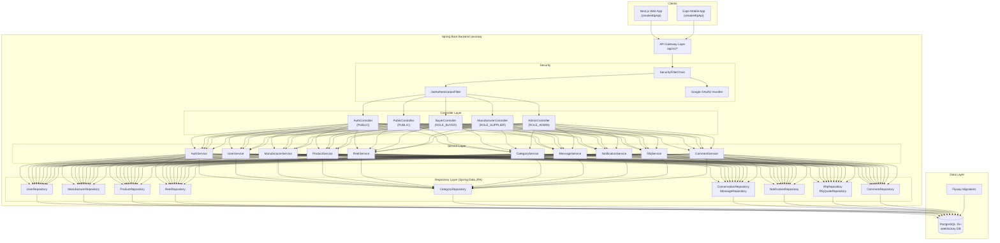

# SeekFactory Backend — Enterprise Architecture Guide

> **Stack:** Java 25 · Spring Boot 4.1.1 · PostgreSQL 15+ · Flyway · JWT · Google OAuth2 · Lombok · ModelMapper · SpringDoc OpenAPI

---

## Table of Contents

1. [Architecture Overview](#1-architecture-overview)
2. [Final Package Structure](#2-final-package-structure)
3. [Dependencies to Add to pom.xml](#3-dependencies-to-add-to-pomxml)
4. [application.yaml — Full Configuration](#4-applicationyaml--full-configuration)
5. [Enums](#5-enums)
6. [Base Entity (Auditing)](#6-base-entity-auditing)
7. [JPA Entities](#7-jpa-entities)
8. [Repositories](#8-repositories)
9. [DTOs (Request / Response)](#9-dtos-request--response)
10. [Exceptions & Global Error Handler](#10-exceptions--global-error-handler)
11. [Security Configuration (JWT + Google OAuth)](#11-security-configuration-jwt--google-oauth)
12. [Utility Classes](#12-utility-classes)
13. [Service Interfaces](#13-service-interfaces)
14. [Service Implementations](#14-service-implementations)
15. [Controllers & API Endpoint Map](#15-controllers--api-endpoint-map)
16. [Step-by-Step Implementation Order](#16-step-by-step-implementation-order)

---

## 1. Architecture Overview

Your backend serves **two frontends** (Next.js web + Expo React Native app) through a **single unified REST API**. Both frontends already define an identical `ApiClient` contract interface ready to swap from mocks to real HTTP calls.

### Architecture Diagram



### Key Design Principles

| Principle | How We Apply It |
|---|---|
| **Separation of Concerns** | Controller → Service → Repository. Controllers NEVER touch repositories directly. |
| **DTO Pattern** | Entities never leak to API responses. Always map Entity → ResponseDTO via ModelMapper. |
| **Interface-First Services** | Every service has an interface (`UserService`) and implementation (`UserServiceImpl`). Enables unit testing with mocks. |
| **Role-Based Access** | Three security tiers: `PUBLIC` (no auth), `USER` (authenticated buyer/supplier), `ADMIN` (platform admin). |
| **Auditing** | All entities extend `BaseEntity` with `createdAt` and `updatedAt` auto-managed by JPA. |
| **Stateless Auth** | JWT tokens (no sessions). Access + Refresh token pair. |
| **Global Exception Handling** | Single `@RestControllerAdvice` catches all exceptions and returns consistent error responses. |

---

## 2. Final Package Structure

```
src/main/java/seekfactory/axoraa/
│
├── AxoraaApplication.java
│
├── config/                              # All configuration classes
│   ├── SecurityConfig.java              # SecurityFilterChain, CORS, endpoint rules
│   ├── JwtConfig.java                   # JWT secret, expiry, algorithm config
│   ├── ModelMapperConfig.java           # ModelMapper bean and custom mappings
│   ├── OpenApiConfig.java               # Swagger/OpenAPI metadata and JWT scheme
│   ├── AuditingConfig.java              # JPA Auditing enable
│   └── CorsConfig.java                  # CORS allowed origins for web + app
│
├── enums/                               # All application enumerations
│   ├── UserRole.java                    # ROLE_BUYER, ROLE_SUPPLIER, ROLE_ADMIN
│   ├── AuthProvider.java                # LOCAL, GOOGLE, PHONE
│   ├── FeedTab.java                     # FOR_YOU, FOLLOWING
│   ├── RfqStatus.java                   # SUBMITTED, REVIEWING, QUOTING, etc.
│   ├── QuoteStatus.java                 # PENDING, ACCEPTED, REJECTED, EXPIRED
│   ├── Currency.java                    # INR, USD, EUR, CNY, etc.
│   ├── Incoterm.java                    # FOB, CIF, EXW, DDP
│   ├── NotificationType.java            # SYSTEM, QUOTE, RFQ, MESSAGE, FOLLOW
│   └── SenderType.java                  # USER, FACTORY
│
├── entity/                              # JPA Entity classes
│   ├── BaseEntity.java                  # Abstract: id, createdAt, updatedAt
│   ├── User.java
│   ├── Category.java
│   ├── Manufacturer.java
│   ├── Product.java
│   ├── Reel.java
│   ├── ReelLike.java
│   ├── ReelSave.java
│   ├── Comment.java
│   ├── CommentLike.java
│   ├── Rfq.java
│   ├── RfqQuote.java
│   ├── Conversation.java
│   ├── Message.java
│   └── Notification.java
│
├── repository/                          # Spring Data JPA repositories
│   ├── UserRepository.java
│   ├── CategoryRepository.java
│   ├── ManufacturerRepository.java
│   ├── ProductRepository.java
│   ├── ReelRepository.java
│   ├── ReelLikeRepository.java
│   ├── ReelSaveRepository.java
│   ├── CommentRepository.java
│   ├── CommentLikeRepository.java
│   ├── RfqRepository.java
│   ├── RfqQuoteRepository.java
│   ├── ConversationRepository.java
│   ├── MessageRepository.java
│   └── NotificationRepository.java
│
├── dto/                                 # Data Transfer Objects
│   ├── request/                         # Incoming payloads
│   │   ├── auth/
│   │   │   ├── RegisterRequest.java
│   │   │   ├── LoginRequest.java
│   │   │   ├── PhoneLoginRequest.java
│   │   │   ├── GoogleAuthRequest.java
│   │   │   └── RefreshTokenRequest.java
│   │   ├── rfq/
│   │   │   └── RfqCreateRequest.java
│   │   ├── comment/
│   │   │   ├── CommentCreateRequest.java
│   │   │   └── ReplyCreateRequest.java
│   │   ├── message/
│   │   │   └── MessageSendRequest.java
│   │   ├── manufacturer/
│   │   │   └── ManufacturerUpdateRequest.java
│   │   └── user/
│   │       └── UserUpdateRequest.java
│   │
│   └── response/                        # Outgoing payloads
│       ├── auth/
│       │   └── AuthResponse.java
│       ├── user/
│       │   └── UserResponse.java
│       ├── manufacturer/
│       │   ├── ManufacturerResponse.java
│       │   └── ManufacturerDetailResponse.java
│       ├── product/
│       │   ├── ProductResponse.java
│       │   └── ProductDetailResponse.java
│       ├── reel/
│       │   ├── ReelResponse.java
│       │   └── FeedItemResponse.java
│       ├── category/
│       │   └── CategoryResponse.java
│       ├── comment/
│       │   ├── CommentResponse.java
│       │   └── CommentReplyResponse.java
│       ├── rfq/
│       │   ├── RfqResponse.java
│       │   └── RfqQuoteResponse.java
│       ├── message/
│       │   ├── ConversationResponse.java
│       │   └── MessageResponse.java
│       ├── notification/
│       │   └── NotificationResponse.java
│       └── common/
│           ├── ApiResponse.java         # Wrapper: { success, message, data, timestamp }
│           ├── PagedResponse.java       # Wrapper: { content, page, size, totalElements }
│           └── ErrorResponse.java       # Wrapper: { success=false, message, errors, status }
│
├── services/                            # Service interfaces
│   ├── AuthService.java
│   ├── UserService.java
│   ├── ManufacturerService.java
│   ├── ProductService.java
│   ├── ReelService.java
│   ├── CategoryService.java
│   ├── CommentService.java
│   ├── RfqService.java
│   ├── ConversationService.java
│   └── NotificationService.java
│
├── services/serviceImpl/                # Service implementations
│   ├── AuthServiceImpl.java
│   ├── UserServiceImpl.java
│   ├── ManufacturerServiceImpl.java
│   ├── ProductServiceImpl.java
│   ├── ReelServiceImpl.java
│   ├── CategoryServiceImpl.java
│   ├── CommentServiceImpl.java
│   ├── RfqServiceImpl.java
│   ├── ConversationServiceImpl.java
│   └── NotificationServiceImpl.java
│
├── controller/                          # REST Controllers
│   ├── AuthController.java              # PUBLIC: register, login, google, refresh
│   ├── CategoryController.java          # PUBLIC: list, roots, children, bySlug
│   ├── FeedController.java              # PUBLIC: reels feed by tab
│   ├── ManufacturerController.java      # PUBLIC: list verified, detail by slug
│   ├── ProductController.java           # PUBLIC: trending, detail by slug, byCategory
│   ├── CommentController.java           # PUBLIC read / AUTHENTICATED write
│   ├── RfqController.java              # AUTHENTICATED: submit RFQ
│   ├── ConversationController.java      # AUTHENTICATED: list, send messages
│   ├── NotificationController.java      # AUTHENTICATED: list, unread count
│   ├── UserController.java             # AUTHENTICATED: profile, update
│   └── AdminController.java            # ADMIN: user mgmt, manufacturer verification
│
├── exceptions/                          # Custom exceptions
│   ├── ResourceNotFoundException.java
│   ├── DuplicateResourceException.java
│   ├── UnauthorizedException.java
│   ├── ForbiddenException.java
│   ├── BadRequestException.java
│   ├── TokenExpiredException.java
│   └── GlobalExceptionHandler.java      # @RestControllerAdvice
│
└── utils/                               # Utility classes
    ├── JwtTokenProvider.java            # JWT generation, validation, parsing
    ├── SlugUtils.java                   # URL-safe slug generation
    ├── IdGenerator.java                 # UUID / ULID generation
    └── SecurityUtils.java              # Get current authenticated user from context
```

---

## 3. Dependencies to Add to pom.xml

You need to add **ModelMapper** and **JJWT** (for JWT). Add these inside `<dependencies>`:

```xml
<!-- ModelMapper — Entity <-> DTO mapping -->
<dependency>
    <groupId>org.modelmapper</groupId>
    <artifactId>modelmapper</artifactId>
    <version>3.2.2</version>
</dependency>

<!-- JJWT — JWT Token generation and validation -->
<dependency>
    <groupId>io.jsonwebtoken</groupId>
    <artifactId>jjwt-api</artifactId>
    <version>0.12.6</version>
</dependency>
<dependency>
    <groupId>io.jsonwebtoken</groupId>
    <artifactId>jjwt-impl</artifactId>
    <version>0.12.6</version>
    <scope>runtime</scope>
</dependency>
<dependency>
    <groupId>io.jsonwebtoken</groupId>
    <artifactId>jjwt-jackson</artifactId>
    <version>0.12.6</version>
    <scope>runtime</scope>
</dependency>

<!-- Google API Client — Verify Google ID tokens -->
<dependency>
    <groupId>com.google.api-client</groupId>
    <artifactId>google-api-client</artifactId>
    <version>2.8.2</version>
</dependency>
```

---

## 4. application.yaml — Full Configuration

Replace your existing `application.yaml` with this enterprise configuration:

```yaml
spring:
  application:
    name: axoraa

  # ─── Database ───────────────────────────────────────────────
  datasource:
    url: jdbc:postgresql://localhost:5432/seekfactory
    username: postgres
    password: root
    driver-class-name: org.postgresql.Driver
    hikari:
      maximum-pool-size: 20
      minimum-idle: 5
      idle-timeout: 300000
      connection-timeout: 20000
      max-lifetime: 1200000

  # ─── JPA / Hibernate ───────────────────────────────────────
  jpa:
    hibernate:
      ddl-auto: validate            # IMPORTANT: Flyway manages schema, Hibernate only validates
    show-sql: false                  # Set true only during development
    open-in-view: false              # Enterprise best practice: disable OSIV
    properties:
      hibernate:
        format_sql: true
        default_batch_fetch_size: 16
        jdbc:
          batch_size: 25
        order_inserts: true
        order_updates: true

  # ─── Flyway ─────────────────────────────────────────────────
  flyway:
    enabled: true
    baseline-on-migrate: true
    locations: classpath:db/migration

  # ─── Jackson ─────────────────────────────────────────────────
  jackson:
    serialization:
      write-dates-as-timestamps: false
    default-property-inclusion: non_null
    property-naming-strategy: SNAKE_CASE

# ─── Application Custom Properties ────────────────────────────
app:
  jwt:
    secret: YOUR_256_BIT_SECRET_KEY_CHANGE_THIS_IN_PRODUCTION_MINIMUM_32_CHARS
    access-token-expiry: 86400000          # 24 hours in milliseconds
    refresh-token-expiry: 604800000        # 7 days in milliseconds
    issuer: seekfactory-axoraa

  google:
    client-id: YOUR_GOOGLE_OAUTH_CLIENT_ID

  cors:
    allowed-origins:
      - http://localhost:3000              # Next.js dev server
      - http://localhost:8081              # Expo dev server
      - https://seekfactory.com           # Production web
      - https://www.seekfactory.com

# ─── Actuator ─────────────────────────────────────────────────
management:
  endpoints:
    web:
      exposure:
        include: health,info,metrics
  endpoint:
    health:
      show-details: when_authorized

# ─── OpenAPI / Swagger ────────────────────────────────────────
springdoc:
  api-docs:
    path: /api-docs
  swagger-ui:
    path: /swagger-ui.html
    tags-sorter: alpha
    operations-sorter: alpha

# ─── Server ───────────────────────────────────────────────────
server:
  port: 8080
  error:
    include-message: always
    include-binding-errors: always
```

> [!IMPORTANT]
> **Change `ddl-auto` from `update` to `validate`!** Since you use Flyway for migrations, Hibernate should only *validate* that entities match the schema — never modify it. This is the enterprise standard.

> [!WARNING]
> **Replace `app.jwt.secret`** with a real 256-bit random secret in production. Never commit secrets to version control. Use environment variables or a vault.

---

## 5. Enums

### 5.1 `UserRole.java`

```java
package seekfactory.axoraa.enums;

/**
 * Defines the access roles within the SeekFactory platform.
 * Maps directly to Spring Security granted authorities.
 */
public enum UserRole {
    ROLE_BUYER,
    ROLE_SUPPLIER,
    ROLE_ADMIN
}
```

**Why prefix with `ROLE_`?** — Spring Security's `hasRole("BUYER")` internally checks for `ROLE_BUYER`. By storing the full prefixed value, we avoid confusion and make database values self-documenting.

### 5.2 `AuthProvider.java`

```java
package seekfactory.axoraa.enums;

/**
 * Tracks how a user originally registered / authenticated.
 * Determines which credentials are required at login.
 */
public enum AuthProvider {
    LOCAL,     // Email + Password
    GOOGLE,    // Google OAuth2 ID token
    PHONE      // SMS OTP (future implementation)
}
```

### 5.3 `FeedTab.java`

```java
package seekfactory.axoraa.enums;

/**
 * Video feed discovery tabs mirroring the frontend segmented control.
 */
public enum FeedTab {
    FOR_YOU,
    FOLLOWING
}
```

### 5.4 `RfqStatus.java`

```java
package seekfactory.axoraa.enums;

/**
 * Lifecycle stages of a Request for Quotation.
 * Follows the standard B2B procurement workflow.
 */
public enum RfqStatus {
    SUBMITTED,       // Buyer submitted, awaiting supplier matches
    REVIEWING,       // Platform reviewing and matching suppliers
    QUOTING,         // Sent to suppliers, quotes being collected
    QUOTED,          // At least one supplier quote received
    ACCEPTED,        // Buyer accepted a quote
    IN_PRODUCTION,   // Manufacturing started
    COMPLETED,       // Order fulfilled
    CANCELLED        // Cancelled by buyer or system
}
```

### 5.5 `QuoteStatus.java`

```java
package seekfactory.axoraa.enums;

/**
 * Status of an individual supplier's quotation response to an RFQ.
 */
public enum QuoteStatus {
    PENDING,
    ACCEPTED,
    REJECTED,
    EXPIRED
}
```

### 5.6 `Currency.java`

```java
package seekfactory.axoraa.enums;

/**
 * Supported transaction currencies.
 * Aligned with frontend LanguageCurrencyDropdown options.
 */
public enum Currency {
    INR,
    USD,
    EUR,
    CNY,
    GBP,
    CAD,
    AUD,
    JPY,
    AED,
    SGD
}
```

### 5.7 `Incoterm.java`

```java
package seekfactory.axoraa.enums;

/**
 * International Commercial Terms (Incoterms 2020).
 * Determines shipping responsibility split between buyer and supplier.
 */
public enum Incoterm {
    FOB,   // Free on Board — seller delivers to port
    CIF,   // Cost, Insurance & Freight — seller covers shipping + insurance
    EXW,   // Ex Works — buyer bears all transport
    DDP    // Delivered Duty Paid — seller covers everything to buyer's door
}
```

### 5.8 `NotificationType.java`

```java
package seekfactory.axoraa.enums;

/**
 * Classification of platform notifications.
 * Used by frontend to filter notification tabs.
 */
public enum NotificationType {
    SYSTEM,
    QUOTE,
    RFQ,
    MESSAGE,
    FOLLOW
}
```

### 5.9 `SenderType.java`

```java
package seekfactory.axoraa.enums;

/**
 * Identifies the sender type in B2B chat conversations.
 */
public enum SenderType {
    USER,
    FACTORY
}
```

---

## 6. Base Entity (Auditing)

Every entity in the system extends this base class. It provides:
- **Auto-generated ID** (UUID string)
- **Automatic timestamps** via JPA Auditing (`@CreatedDate`, `@LastModifiedDate`)

### 6.1 `AuditingConfig.java`

```java
package seekfactory.axoraa.config;

import org.springframework.context.annotation.Configuration;
import org.springframework.data.jpa.repository.config.EnableJpaAuditing;

/**
 * Enables JPA Auditing so that @CreatedDate and @LastModifiedDate
 * are automatically populated by Spring Data.
 */
@Configuration
@EnableJpaAuditing
public class AuditingConfig {
}
```

### 6.2 `BaseEntity.java`

```java
package seekfactory.axoraa.entity;

import jakarta.persistence.Column;
import jakarta.persistence.EntityListeners;
import jakarta.persistence.Id;
import jakarta.persistence.MappedSuperclass;
import jakarta.persistence.PrePersist;
import lombok.Getter;
import lombok.Setter;
import org.springframework.data.annotation.CreatedDate;
import org.springframework.data.annotation.LastModifiedDate;
import org.springframework.data.jpa.domain.support.AuditingEntityListener;

import java.time.OffsetDateTime;
import java.util.UUID;

/**
 * Abstract base entity providing common fields for all JPA entities.
 *
 * <ul>
 *   <li><b>id</b> — UUID primary key, auto-generated before persist</li>
 *   <li><b>createdAt</b> — Set once when the entity is first saved</li>
 *   <li><b>updatedAt</b> — Updated automatically on every save</li>
 * </ul>
 *
 * All concrete entities MUST extend this class.
 */
@MappedSuperclass
@EntityListeners(AuditingEntityListener.class)
@Getter
@Setter
public abstract class BaseEntity {

    @Id
    @Column(name = "id", length = 64, nullable = false, updatable = false)
    private String id;

    @CreatedDate
    @Column(name = "created_at", nullable = false, updatable = false)
    private OffsetDateTime createdAt;

    @LastModifiedDate
    @Column(name = "updated_at", nullable = false)
    private OffsetDateTime updatedAt;

    /**
     * Generates a UUID-based ID before the entity is persisted for the first time.
     * This ensures IDs are set before any flush/cascade operations.
     */
    @PrePersist
    protected void onCreate() {
        if (this.id == null) {
            this.id = UUID.randomUUID().toString();
        }
    }
}
```

**Why `@MappedSuperclass` and not `@Entity`?**
- `@MappedSuperclass` means this class is NOT a table. It just injects its columns into child entity tables.
- `@Entity` would create a separate `base_entity` table which we don't want.

**Why `String` ID and not `UUID` type?**
- Your Flyway schema uses `VARCHAR(64)` for all primary keys.
- Both frontends send/receive IDs as strings.
- String IDs are portable across databases.

---

## 7. JPA Entities

> [!TIP]
> **Lombok annotations explained:**
> - `@Data` = `@Getter` + `@Setter` + `@ToString` + `@EqualsAndHashCode` + `@RequiredArgsConstructor`
> - `@Builder` = Generates the builder pattern (e.g., `User.builder().name("John").build()`)
> - `@NoArgsConstructor` = JPA requires a no-arg constructor
> - `@AllArgsConstructor` = Required by `@Builder`
>
> **Why not `@Data` on entities?** — Using `@Data` generates `equals()` and `hashCode()` based on ALL fields. For JPA entities, this causes issues with lazy-loaded collections. Instead, we use `@Getter @Setter` and override `equals`/`hashCode` on `BaseEntity` using just `id`.

### 7.1 `User.java`

```java
package seekfactory.axoraa.entity;

import jakarta.persistence.*;
import lombok.*;
import seekfactory.axoraa.enums.AuthProvider;
import seekfactory.axoraa.enums.UserRole;

/**
 * Represents a platform user — either a Buyer, Supplier (Manufacturer), or Admin.
 *
 * Authentication supports three providers:
 * - LOCAL: Traditional email + bcrypt password hash
 * - GOOGLE: Google OAuth2 (stores google_id for lookup)
 * - PHONE: SMS OTP verification (future)
 *
 * Maps to the `users` table defined in V1__init_schema.sql.
 */
@Entity
@Table(name = "users", indexes = {
        @Index(name = "idx_users_email", columnList = "email"),
        @Index(name = "idx_users_phone", columnList = "phone"),
        @Index(name = "idx_users_role", columnList = "role")
})
@Getter
@Setter
@NoArgsConstructor
@AllArgsConstructor
@Builder
public class User extends BaseEntity {

    @Column(name = "email", unique = true)
    private String email;

    @Column(name = "phone", length = 50, unique = true)
    private String phone;

    @Column(name = "password_hash")
    private String passwordHash;

    @Enumerated(EnumType.STRING)
    @Column(name = "role", length = 32, nullable = false)
    private UserRole role;

    @Enumerated(EnumType.STRING)
    @Column(name = "auth_provider", length = 32, nullable = false)
    private AuthProvider authProvider;

    @Column(name = "google_id", unique = true)
    private String googleId;

    @Column(name = "name", nullable = false)
    private String name;

    @Column(name = "company_name")
    private String companyName;

    @Column(name = "avatar_url", columnDefinition = "TEXT")
    private String avatarUrl;

    @Column(name = "industry")
    private String industry;

    @Column(name = "country", length = 100)
    private String country;

    @Column(name = "is_active", nullable = false)
    @Builder.Default
    private Boolean isActive = true;

    // ─── Relationships ───────────────────────────────────────
    @OneToOne(mappedBy = "user", cascade = CascadeType.ALL, fetch = FetchType.LAZY)
    private Manufacturer manufacturer;
}
```

### 7.2 `Category.java`

```java
package seekfactory.axoraa.entity;

import jakarta.persistence.*;
import lombok.*;

import java.util.ArrayList;
import java.util.List;

/**
 * Hierarchical machinery taxonomy node.
 *
 * Root categories have parentId = null.
 * Child categories reference their parent via self-join.
 * The frontend uses 20 specific icon keys for visual representation.
 *
 * Example hierarchy:
 *   Agriculture (root, icon="agriculture")
 *   ├── Harvesters (child)
 *   ├── Tractors (child)
 *   └── Seeders (child)
 */
@Entity
@Table(name = "categories", indexes = {
        @Index(name = "idx_categories_slug", columnList = "slug"),
        @Index(name = "idx_categories_parent_id", columnList = "parent_id")
})
@Getter
@Setter
@NoArgsConstructor
@AllArgsConstructor
@Builder
public class Category extends BaseEntity {

    @Column(name = "slug", length = 128, unique = true, nullable = false)
    private String slug;

    @Column(name = "name", nullable = false)
    private String name;

    @Column(name = "icon", length = 64, nullable = false)
    @Builder.Default
    private String icon = "other";

    @ManyToOne(fetch = FetchType.LAZY)
    @JoinColumn(name = "parent_id")
    private Category parent;

    @OneToMany(mappedBy = "parent", cascade = CascadeType.ALL)
    @Builder.Default
    private List<Category> children = new ArrayList<>();

    @Column(name = "listing_count", nullable = false)
    @Builder.Default
    private Integer listingCount = 0;
}
```

### 7.3 `Manufacturer.java`

```java
package seekfactory.axoraa.entity;

import jakarta.persistence.*;
import lombok.*;

import java.util.ArrayList;
import java.util.HashSet;
import java.util.List;
import java.util.Set;

/**
 * Represents a verified manufacturing plant / factory on the platform.
 *
 * Each manufacturer is linked 1:1 to a User with ROLE_SUPPLIER.
 * Has many-to-many relationship with Categories (the types of machinery they produce).
 * Export countries stored as an @ElementCollection for simple string storage.
 */
@Entity
@Table(name = "manufacturers", indexes = {
        @Index(name = "idx_manufacturers_slug", columnList = "slug"),
        @Index(name = "idx_manufacturers_verified", columnList = "verified")
})
@Getter
@Setter
@NoArgsConstructor
@AllArgsConstructor
@Builder
public class Manufacturer extends BaseEntity {

    @OneToOne(fetch = FetchType.LAZY)
    @JoinColumn(name = "user_id", unique = true)
    private User user;

    @Column(name = "slug", length = 128, unique = true, nullable = false)
    private String slug;

    @Column(name = "name", nullable = false)
    private String name;

    @Column(name = "logo_url", columnDefinition = "TEXT")
    private String logoUrl;

    @Column(name = "cover_url", columnDefinition = "TEXT")
    private String coverUrl;

    @Column(name = "country", length = 100, nullable = false)
    private String country;

    @Column(name = "location", nullable = false)
    private String location;

    @Column(name = "verified", nullable = false)
    @Builder.Default
    private Boolean verified = false;

    @Column(name = "premium", nullable = false)
    @Builder.Default
    private Boolean premium = false;

    @Column(name = "years_established", nullable = false)
    @Builder.Default
    private Integer yearsEstablished = 2000;

    @Column(name = "factory_size", length = 100)
    private String factorySize;

    @Column(name = "employees", length = 100)
    private String employees;

    @Column(name = "description", columnDefinition = "TEXT")
    private String description;

    @Column(name = "follower_count", nullable = false)
    @Builder.Default
    private Integer followerCount = 0;

    @Column(name = "chairman_name")
    private String chairmanName;

    // ─── Export Countries (ElementCollection) ─────────────────
    @ElementCollection
    @CollectionTable(
            name = "manufacturer_export_countries",
            joinColumns = @JoinColumn(name = "manufacturer_id")
    )
    @Column(name = "country_name")
    @Builder.Default
    private Set<String> exportCountries = new HashSet<>();

    // ─── Category Associations (ManyToMany) ───────────────────
    @ManyToMany
    @JoinTable(
            name = "manufacturer_categories",
            joinColumns = @JoinColumn(name = "manufacturer_id"),
            inverseJoinColumns = @JoinColumn(name = "category_id")
    )
    @Builder.Default
    private Set<Category> categories = new HashSet<>();

    // ─── Products ─────────────────────────────────────────────
    @OneToMany(mappedBy = "manufacturer", cascade = CascadeType.ALL)
    @Builder.Default
    private List<Product> products = new ArrayList<>();

    // ─── Reels ────────────────────────────────────────────────
    @OneToMany(mappedBy = "manufacturer", cascade = CascadeType.ALL)
    @Builder.Default
    private List<Reel> reels = new ArrayList<>();
}
```

### 7.4 `Product.java`

```java
package seekfactory.axoraa.entity;

import jakarta.persistence.*;
import lombok.*;
import org.hibernate.annotations.JdbcTypeCode;
import org.hibernate.type.SqlTypes;

import java.math.BigDecimal;
import java.util.HashMap;
import java.util.Map;

/**
 * A manufactured product listed on the marketplace.
 *
 * The `specs` field uses PostgreSQL JSONB to store dynamic key-value
 * technical specifications (e.g., "Tolerance" → "±0.005mm",
 * "Material" → "SS304", "LeadTime" → "15 days").
 *
 * This avoids rigid column definitions for specs that vary wildly
 * across product categories.
 */
@Entity
@Table(name = "products", indexes = {
        @Index(name = "idx_products_slug", columnList = "slug"),
        @Index(name = "idx_products_manufacturer_id", columnList = "manufacturer_id"),
        @Index(name = "idx_products_category_id", columnList = "category_id")
})
@Getter
@Setter
@NoArgsConstructor
@AllArgsConstructor
@Builder
public class Product extends BaseEntity {

    @Column(name = "slug", length = 128, unique = true, nullable = false)
    private String slug;

    @ManyToOne(fetch = FetchType.LAZY)
    @JoinColumn(name = "manufacturer_id", nullable = false)
    private Manufacturer manufacturer;

    @ManyToOne(fetch = FetchType.LAZY)
    @JoinColumn(name = "category_id", nullable = false)
    private Category category;

    @Column(name = "name", nullable = false)
    private String name;

    @Column(name = "image_url", nullable = false, columnDefinition = "TEXT")
    private String imageUrl;

    @Column(name = "description", columnDefinition = "TEXT")
    private String description;

    @Column(name = "price_inr", precision = 12, scale = 2, nullable = false)
    @Builder.Default
    private BigDecimal priceInr = BigDecimal.ZERO;

    @Column(name = "unit", length = 50, nullable = false)
    @Builder.Default
    private String unit = "piece";

    @Column(name = "moq", length = 100, nullable = false)
    @Builder.Default
    private String moq = "1 piece";

    @JdbcTypeCode(SqlTypes.JSON)
    @Column(name = "specs", columnDefinition = "jsonb")
    @Builder.Default
    private Map<String, String> specs = new HashMap<>();

    @Column(name = "is_active", nullable = false)
    @Builder.Default
    private Boolean isActive = true;
}
```

### 7.5 `Reel.java`

```java
package seekfactory.axoraa.entity;

import jakarta.persistence.*;
import lombok.*;
import seekfactory.axoraa.enums.FeedTab;

import java.util.HashSet;
import java.util.Set;

/**
 * A short-form industrial video showcase — the core discovery mechanism.
 *
 * Reels appear in the vertical-scrolling feed (like TikTok/Instagram Reels)
 * and are the primary way buyers discover manufacturing capabilities.
 *
 * Each reel belongs to a manufacturer and can feature multiple products.
 * Hashtags stored as @ElementCollection for simple tag storage.
 */
@Entity
@Table(name = "reels", indexes = {
        @Index(name = "idx_reels_manufacturer_id", columnList = "manufacturer_id"),
        @Index(name = "idx_reels_feed_tab", columnList = "feed_tab")
})
@Getter
@Setter
@NoArgsConstructor
@AllArgsConstructor
@Builder
public class Reel extends BaseEntity {

    @ManyToOne(fetch = FetchType.LAZY)
    @JoinColumn(name = "manufacturer_id", nullable = false)
    private Manufacturer manufacturer;

    @Column(name = "title", nullable = false)
    private String title;

    @Column(name = "description", columnDefinition = "TEXT")
    private String description;

    @Column(name = "poster_url", nullable = false, columnDefinition = "TEXT")
    private String posterUrl;

    @Column(name = "video_url", columnDefinition = "TEXT")
    private String videoUrl;

    @Column(name = "duration_sec", nullable = false)
    @Builder.Default
    private Integer durationSec = 0;

    @Column(name = "start_sec", nullable = false)
    @Builder.Default
    private Integer startSec = 0;

    @Column(name = "views_count", nullable = false)
    @Builder.Default
    private Long viewsCount = 0L;

    @Column(name = "likes_count", nullable = false)
    @Builder.Default
    private Integer likesCount = 0;

    @Column(name = "comments_count", nullable = false)
    @Builder.Default
    private Integer commentsCount = 0;

    @Column(name = "shares_count", nullable = false)
    @Builder.Default
    private Integer sharesCount = 0;

    @Column(name = "saves_count", nullable = false)
    @Builder.Default
    private Integer savesCount = 0;

    @Enumerated(EnumType.STRING)
    @Column(name = "feed_tab", length = 32, nullable = false)
    @Builder.Default
    private FeedTab feedTab = FeedTab.FOR_YOU;

    // ─── Hashtags (ElementCollection) ─────────────────────────
    @ElementCollection
    @CollectionTable(
            name = "reel_hashtags",
            joinColumns = @JoinColumn(name = "reel_id")
    )
    @Column(name = "hashtag")
    @Builder.Default
    private Set<String> hashtags = new HashSet<>();

    // ─── Featured Products (ManyToMany) ───────────────────────
    @ManyToMany
    @JoinTable(
            name = "reel_products",
            joinColumns = @JoinColumn(name = "reel_id"),
            inverseJoinColumns = @JoinColumn(name = "product_id")
    )
    @Builder.Default
    private Set<Product> products = new HashSet<>();
}
```

### 7.6 `ReelLike.java` & `ReelSave.java`

```java
package seekfactory.axoraa.entity;

import jakarta.persistence.*;
import lombok.*;

/**
 * Tracks a user's "like" on a reel. Unique constraint prevents double-liking.
 */
@Entity
@Table(name = "reel_likes", uniqueConstraints = {
        @UniqueConstraint(columnNames = {"reel_id", "user_id"})
})
@Getter
@Setter
@NoArgsConstructor
@AllArgsConstructor
@Builder
public class ReelLike extends BaseEntity {

    @ManyToOne(fetch = FetchType.LAZY)
    @JoinColumn(name = "reel_id", nullable = false)
    private Reel reel;

    @ManyToOne(fetch = FetchType.LAZY)
    @JoinColumn(name = "user_id", nullable = false)
    private User user;
}
```

```java
package seekfactory.axoraa.entity;

import jakarta.persistence.*;
import lombok.*;

/**
 * Tracks a user's "save/bookmark" on a reel. Unique constraint prevents double-saving.
 */
@Entity
@Table(name = "reel_saves", uniqueConstraints = {
        @UniqueConstraint(columnNames = {"reel_id", "user_id"})
})
@Getter
@Setter
@NoArgsConstructor
@AllArgsConstructor
@Builder
public class ReelSave extends BaseEntity {

    @ManyToOne(fetch = FetchType.LAZY)
    @JoinColumn(name = "reel_id", nullable = false)
    private Reel reel;

    @ManyToOne(fetch = FetchType.LAZY)
    @JoinColumn(name = "user_id", nullable = false)
    private User user;
}
```

### 7.7 `Comment.java` & `CommentLike.java`

```java
package seekfactory.axoraa.entity;

import jakarta.persistence.*;
import lombok.*;

import java.util.ArrayList;
import java.util.List;

/**
 * A comment on a reel. Supports threading via self-referencing parent_id.
 *
 * Top-level comments have parent = null.
 * Replies have parent pointing to the top-level comment.
 *
 * Author metadata is denormalized (authorName, authorAvatarUrl, etc.)
 * for performance — avoids joining User table on every comment render.
 */
@Entity
@Table(name = "comments", indexes = {
        @Index(name = "idx_comments_reel_id", columnList = "reel_id"),
        @Index(name = "idx_comments_parent_id", columnList = "parent_id")
})
@Getter
@Setter
@NoArgsConstructor
@AllArgsConstructor
@Builder
public class Comment extends BaseEntity {

    @ManyToOne(fetch = FetchType.LAZY)
    @JoinColumn(name = "reel_id", nullable = false)
    private Reel reel;

    @ManyToOne(fetch = FetchType.LAZY)
    @JoinColumn(name = "parent_id")
    private Comment parent;

    @OneToMany(mappedBy = "parent", cascade = CascadeType.ALL, orphanRemoval = true)
    @Builder.Default
    private List<Comment> replies = new ArrayList<>();

    @ManyToOne(fetch = FetchType.LAZY)
    @JoinColumn(name = "user_id", nullable = false)
    private User user;

    @Column(name = "author_name", nullable = false)
    private String authorName;

    @Column(name = "author_avatar_url", columnDefinition = "TEXT")
    private String authorAvatarUrl;

    @Column(name = "author_company")
    private String authorCompany;

    @Column(name = "author_country", length = 100)
    private String authorCountry;

    @Column(name = "is_verified", nullable = false)
    @Builder.Default
    private Boolean isVerified = false;

    @Column(name = "content", nullable = false, columnDefinition = "TEXT")
    private String content;

    @Column(name = "likes_count", nullable = false)
    @Builder.Default
    private Integer likesCount = 0;
}
```

```java
package seekfactory.axoraa.entity;

import jakarta.persistence.*;
import lombok.*;

/**
 * Tracks a user's "like" on a comment.
 */
@Entity
@Table(name = "comment_likes", uniqueConstraints = {
        @UniqueConstraint(columnNames = {"comment_id", "user_id"})
})
@Getter
@Setter
@NoArgsConstructor
@AllArgsConstructor
@Builder
public class CommentLike extends BaseEntity {

    @ManyToOne(fetch = FetchType.LAZY)
    @JoinColumn(name = "comment_id", nullable = false)
    private Comment comment;

    @ManyToOne(fetch = FetchType.LAZY)
    @JoinColumn(name = "user_id", nullable = false)
    private User user;
}
```

### 7.8 `Rfq.java` & `RfqQuote.java`

```java
package seekfactory.axoraa.entity;

import jakarta.persistence.*;
import lombok.*;
import seekfactory.axoraa.enums.Currency;
import seekfactory.axoraa.enums.Incoterm;
import seekfactory.axoraa.enums.RfqStatus;

import java.util.ArrayList;
import java.util.List;

/**
 * A Request for Quotation — buyer's formal purchasing inquiry.
 *
 * Lifecycle: SUBMITTED → REVIEWING → QUOTING → QUOTED → ACCEPTED → IN_PRODUCTION → COMPLETED
 * Each RFQ generates a unique reference_number (e.g., "RFQ-2026-000142") for tracking.
 */
@Entity
@Table(name = "rfqs", indexes = {
        @Index(name = "idx_rfqs_user_id", columnList = "user_id"),
        @Index(name = "idx_rfqs_status", columnList = "status")
})
@Getter
@Setter
@NoArgsConstructor
@AllArgsConstructor
@Builder
public class Rfq extends BaseEntity {

    @Column(name = "reference_number", length = 64, unique = true, nullable = false)
    private String referenceNumber;

    @ManyToOne(fetch = FetchType.LAZY)
    @JoinColumn(name = "user_id", nullable = false)
    private User user;

    @Column(name = "product_name", nullable = false)
    private String productName;

    @ManyToOne(fetch = FetchType.LAZY)
    @JoinColumn(name = "category_id")
    private Category category;

    @Column(name = "quantity", length = 100, nullable = false)
    private String quantity;

    @Column(name = "unit", length = 50, nullable = false)
    @Builder.Default
    private String unit = "Pieces";

    @Column(name = "target_price", length = 100)
    private String targetPrice;

    @Enumerated(EnumType.STRING)
    @Column(name = "currency", length = 10, nullable = false)
    @Builder.Default
    private Currency currency = Currency.INR;

    @Enumerated(EnumType.STRING)
    @Column(name = "incoterm", length = 20, nullable = false)
    @Builder.Default
    private Incoterm incoterm = Incoterm.FOB;

    @Column(name = "company_name", nullable = false)
    private String companyName;

    @Column(name = "details", nullable = false, columnDefinition = "TEXT")
    private String details;

    @Column(name = "attachment_name")
    private String attachmentName;

    @Column(name = "attachment_size", length = 50)
    private String attachmentSize;

    @Column(name = "attachment_url", columnDefinition = "TEXT")
    private String attachmentUrl;

    @Enumerated(EnumType.STRING)
    @Column(name = "status", length = 32, nullable = false)
    @Builder.Default
    private RfqStatus status = RfqStatus.SUBMITTED;

    // ─── Quotes from Suppliers ────────────────────────────────
    @OneToMany(mappedBy = "rfq", cascade = CascadeType.ALL)
    @Builder.Default
    private List<RfqQuote> quotes = new ArrayList<>();
}
```

```java
package seekfactory.axoraa.entity;

import jakarta.persistence.*;
import lombok.*;
import seekfactory.axoraa.enums.Currency;
import seekfactory.axoraa.enums.QuoteStatus;

import java.math.BigDecimal;

/**
 * A supplier's price quotation in response to a buyer's RFQ.
 */
@Entity
@Table(name = "rfq_quotes", indexes = {
        @Index(name = "idx_rfq_quotes_rfq_id", columnList = "rfq_id"),
        @Index(name = "idx_rfq_quotes_manufacturer_id", columnList = "manufacturer_id")
})
@Getter
@Setter
@NoArgsConstructor
@AllArgsConstructor
@Builder
public class RfqQuote extends BaseEntity {

    @ManyToOne(fetch = FetchType.LAZY)
    @JoinColumn(name = "rfq_id", nullable = false)
    private Rfq rfq;

    @ManyToOne(fetch = FetchType.LAZY)
    @JoinColumn(name = "manufacturer_id", nullable = false)
    private Manufacturer manufacturer;

    @Column(name = "quote_price", precision = 12, scale = 2, nullable = false)
    private BigDecimal quotePrice;

    @Enumerated(EnumType.STRING)
    @Column(name = "currency", length = 10, nullable = false)
    @Builder.Default
    private Currency currency = Currency.USD;

    @Column(name = "lead_time_days", nullable = false)
    private Integer leadTimeDays;

    @Column(name = "notes", columnDefinition = "TEXT")
    private String notes;

    @Column(name = "attachment_url", columnDefinition = "TEXT")
    private String attachmentUrl;

    @Enumerated(EnumType.STRING)
    @Column(name = "status", length = 32, nullable = false)
    @Builder.Default
    private QuoteStatus status = QuoteStatus.PENDING;
}
```

### 7.9 `Conversation.java` & `Message.java`

```java
package seekfactory.axoraa.entity;

import jakarta.persistence.*;
import lombok.*;

import java.time.OffsetDateTime;
import java.util.ArrayList;
import java.util.List;

/**
 * A B2B chat thread between a buyer and a manufacturer.
 * Unique constraint ensures only one conversation per buyer-manufacturer pair.
 */
@Entity
@Table(name = "conversations", uniqueConstraints = {
        @UniqueConstraint(columnNames = {"buyer_id", "manufacturer_id"})
})
@Getter
@Setter
@NoArgsConstructor
@AllArgsConstructor
@Builder
public class Conversation extends BaseEntity {

    @ManyToOne(fetch = FetchType.LAZY)
    @JoinColumn(name = "buyer_id", nullable = false)
    private User buyer;

    @ManyToOne(fetch = FetchType.LAZY)
    @JoinColumn(name = "manufacturer_id", nullable = false)
    private Manufacturer manufacturer;

    @Column(name = "last_message_text", columnDefinition = "TEXT")
    private String lastMessageText;

    @Column(name = "last_message_at")
    private OffsetDateTime lastMessageAt;

    @Column(name = "unread_count_buyer", nullable = false)
    @Builder.Default
    private Integer unreadCountBuyer = 0;

    @Column(name = "unread_count_supplier", nullable = false)
    @Builder.Default
    private Integer unreadCountSupplier = 0;

    @OneToMany(mappedBy = "conversation", cascade = CascadeType.ALL)
    @Builder.Default
    private List<Message> messages = new ArrayList<>();
}
```

```java
package seekfactory.axoraa.entity;

import jakarta.persistence.*;
import lombok.*;
import seekfactory.axoraa.enums.SenderType;

/**
 * An individual message within a B2B conversation.
 */
@Entity
@Table(name = "messages", indexes = {
        @Index(name = "idx_messages_conversation_id", columnList = "conversation_id")
})
@Getter
@Setter
@NoArgsConstructor
@AllArgsConstructor
@Builder
public class Message extends BaseEntity {

    @ManyToOne(fetch = FetchType.LAZY)
    @JoinColumn(name = "conversation_id", nullable = false)
    private Conversation conversation;

    @ManyToOne(fetch = FetchType.LAZY)
    @JoinColumn(name = "sender_id", nullable = false)
    private User sender;

    @Enumerated(EnumType.STRING)
    @Column(name = "sender_type", length = 32, nullable = false)
    private SenderType senderType;

    @Column(name = "message_text", nullable = false, columnDefinition = "TEXT")
    private String messageText;

    @Column(name = "attachment_name")
    private String attachmentName;

    @Column(name = "attachment_size", length = 50)
    private String attachmentSize;

    @Column(name = "attachment_url", columnDefinition = "TEXT")
    private String attachmentUrl;

    @Column(name = "is_read", nullable = false)
    @Builder.Default
    private Boolean isRead = false;
}
```

### 7.10 `Notification.java`

```java
package seekfactory.axoraa.entity;

import jakarta.persistence.*;
import lombok.*;
import seekfactory.axoraa.enums.NotificationType;

/**
 * Platform notification delivered to a user.
 * Supports filtering by type (System, Quote, RFQ, Message, Follow).
 */
@Entity
@Table(name = "notifications", indexes = {
        @Index(name = "idx_notifications_user_id", columnList = "user_id"),
        @Index(name = "idx_notifications_is_read", columnList = "is_read")
})
@Getter
@Setter
@NoArgsConstructor
@AllArgsConstructor
@Builder
public class Notification extends BaseEntity {

    @ManyToOne(fetch = FetchType.LAZY)
    @JoinColumn(name = "user_id", nullable = false)
    private User user;

    @Column(name = "title", nullable = false)
    private String title;

    @Column(name = "body", nullable = false, columnDefinition = "TEXT")
    private String body;

    @Enumerated(EnumType.STRING)
    @Column(name = "notification_type", length = 64, nullable = false)
    @Builder.Default
    private NotificationType notificationType = NotificationType.SYSTEM;

    @Column(name = "reference_id", length = 64)
    private String referenceId;

    @Column(name = "is_read", nullable = false)
    @Builder.Default
    private Boolean isRead = false;
}
```

---

## 8. Repositories

> [!NOTE]
> Spring Data JPA auto-implements these interfaces at runtime. You only define the interface + method signatures. Spring generates the SQL queries from method names (Derived Query Methods) or from `@Query` annotations.

### 8.1 `UserRepository.java`

```java
package seekfactory.axoraa.repository;

import org.springframework.data.jpa.repository.JpaRepository;
import org.springframework.stereotype.Repository;
import seekfactory.axoraa.entity.User;
import seekfactory.axoraa.enums.UserRole;

import java.util.List;
import java.util.Optional;

@Repository
public interface UserRepository extends JpaRepository<User, String> {

    Optional<User> findByEmail(String email);

    Optional<User> findByPhone(String phone);

    Optional<User> findByGoogleId(String googleId);

    boolean existsByEmail(String email);

    boolean existsByPhone(String phone);

    List<User> findByRole(UserRole role);

    List<User> findByIsActiveTrue();
}
```

### 8.2 `CategoryRepository.java`

```java
package seekfactory.axoraa.repository;

import org.springframework.data.jpa.repository.JpaRepository;
import org.springframework.stereotype.Repository;
import seekfactory.axoraa.entity.Category;

import java.util.List;
import java.util.Optional;

@Repository
public interface CategoryRepository extends JpaRepository<Category, String> {

    Optional<Category> findBySlug(String slug);

    List<Category> findByParentIsNullOrderByNameAsc();          // Root categories

    List<Category> findByParentIdOrderByNameAsc(String parentId); // Children of a parent

    List<Category> findByParentSlugOrderByNameAsc(String slug);   // Children by parent slug
}
```

### 8.3 `ManufacturerRepository.java`

```java
package seekfactory.axoraa.repository;

import org.springframework.data.jpa.repository.JpaRepository;
import org.springframework.stereotype.Repository;
import seekfactory.axoraa.entity.Manufacturer;

import java.util.List;
import java.util.Optional;

@Repository
public interface ManufacturerRepository extends JpaRepository<Manufacturer, String> {

    Optional<Manufacturer> findBySlug(String slug);

    Optional<Manufacturer> findByUserId(String userId);

    List<Manufacturer> findByVerifiedTrueOrderByFollowerCountDesc();

    List<Manufacturer> findByPremiumTrue();
}
```

### 8.4 `ProductRepository.java`

```java
package seekfactory.axoraa.repository;

import org.springframework.data.domain.Pageable;
import org.springframework.data.jpa.repository.JpaRepository;
import org.springframework.data.jpa.repository.Query;
import org.springframework.stereotype.Repository;
import seekfactory.axoraa.entity.Product;

import java.util.List;
import java.util.Optional;

@Repository
public interface ProductRepository extends JpaRepository<Product, String> {

    Optional<Product> findBySlug(String slug);

    List<Product> findByManufacturerIdAndIsActiveTrue(String manufacturerId);

    List<Product> findByCategoryIdAndIsActiveTrue(String categoryId);

    @Query("SELECT p FROM Product p WHERE p.isActive = true ORDER BY p.createdAt DESC")
    List<Product> findTrending(Pageable pageable);

    List<Product> findByManufacturerIdAndIdNot(String manufacturerId, String excludeId);
}
```

### 8.5 `ReelRepository.java`

```java
package seekfactory.axoraa.repository;

import org.springframework.data.jpa.repository.JpaRepository;
import org.springframework.stereotype.Repository;
import seekfactory.axoraa.entity.Reel;
import seekfactory.axoraa.enums.FeedTab;

import java.util.List;

@Repository
public interface ReelRepository extends JpaRepository<Reel, String> {

    List<Reel> findByFeedTabOrderByCreatedAtDesc(FeedTab feedTab);

    List<Reel> findByManufacturerIdOrderByCreatedAtDesc(String manufacturerId);
}
```

### 8.6–8.10 Remaining Repositories

```java
// ReelLikeRepository.java
package seekfactory.axoraa.repository;

import org.springframework.data.jpa.repository.JpaRepository;
import org.springframework.stereotype.Repository;
import seekfactory.axoraa.entity.ReelLike;
import java.util.Optional;

@Repository
public interface ReelLikeRepository extends JpaRepository<ReelLike, String> {
    Optional<ReelLike> findByReelIdAndUserId(String reelId, String userId);
    boolean existsByReelIdAndUserId(String reelId, String userId);
}
```

```java
// ReelSaveRepository.java
package seekfactory.axoraa.repository;

import org.springframework.data.jpa.repository.JpaRepository;
import org.springframework.stereotype.Repository;
import seekfactory.axoraa.entity.ReelSave;
import java.util.Optional;

@Repository
public interface ReelSaveRepository extends JpaRepository<ReelSave, String> {
    Optional<ReelSave> findByReelIdAndUserId(String reelId, String userId);
    boolean existsByReelIdAndUserId(String reelId, String userId);
}
```

```java
// CommentRepository.java
package seekfactory.axoraa.repository;

import org.springframework.data.jpa.repository.JpaRepository;
import org.springframework.stereotype.Repository;
import seekfactory.axoraa.entity.Comment;
import java.util.List;

@Repository
public interface CommentRepository extends JpaRepository<Comment, String> {
    List<Comment> findByReelIdAndParentIsNullOrderByCreatedAtDesc(String reelId);
}
```

```java
// CommentLikeRepository.java
package seekfactory.axoraa.repository;

import org.springframework.data.jpa.repository.JpaRepository;
import org.springframework.stereotype.Repository;
import seekfactory.axoraa.entity.CommentLike;

@Repository
public interface CommentLikeRepository extends JpaRepository<CommentLike, String> {
    boolean existsByCommentIdAndUserId(String commentId, String userId);
}
```

```java
// RfqRepository.java
package seekfactory.axoraa.repository;

import org.springframework.data.jpa.repository.JpaRepository;
import org.springframework.data.jpa.repository.Query;
import org.springframework.stereotype.Repository;
import seekfactory.axoraa.entity.Rfq;
import java.util.List;

@Repository
public interface RfqRepository extends JpaRepository<Rfq, String> {
    List<Rfq> findByUserIdOrderByCreatedAtDesc(String userId);

    @Query("SELECT COALESCE(MAX(CAST(SUBSTRING(r.referenceNumber, 10) AS int)), 0) FROM Rfq r WHERE r.referenceNumber LIKE :yearPrefix")
    int findMaxSequenceForYear(String yearPrefix);
}
```

```java
// RfqQuoteRepository.java
package seekfactory.axoraa.repository;

import org.springframework.data.jpa.repository.JpaRepository;
import org.springframework.stereotype.Repository;
import seekfactory.axoraa.entity.RfqQuote;
import java.util.List;

@Repository
public interface RfqQuoteRepository extends JpaRepository<RfqQuote, String> {
    List<RfqQuote> findByRfqIdOrderByCreatedAtDesc(String rfqId);
    List<RfqQuote> findByManufacturerIdOrderByCreatedAtDesc(String manufacturerId);
}
```

```java
// ConversationRepository.java
package seekfactory.axoraa.repository;

import org.springframework.data.jpa.repository.JpaRepository;
import org.springframework.stereotype.Repository;
import seekfactory.axoraa.entity.Conversation;
import java.util.List;
import java.util.Optional;

@Repository
public interface ConversationRepository extends JpaRepository<Conversation, String> {
    List<Conversation> findByBuyerIdOrderByLastMessageAtDesc(String buyerId);
    Optional<Conversation> findByBuyerIdAndManufacturerId(String buyerId, String manufacturerId);
}
```

```java
// MessageRepository.java
package seekfactory.axoraa.repository;

import org.springframework.data.jpa.repository.JpaRepository;
import org.springframework.stereotype.Repository;
import seekfactory.axoraa.entity.Message;
import java.util.List;

@Repository
public interface MessageRepository extends JpaRepository<Message, String> {
    List<Message> findByConversationIdOrderByCreatedAtAsc(String conversationId);
}
```

```java
// NotificationRepository.java
package seekfactory.axoraa.repository;

import org.springframework.data.jpa.repository.JpaRepository;
import org.springframework.data.jpa.repository.Modifying;
import org.springframework.data.jpa.repository.Query;
import org.springframework.stereotype.Repository;
import seekfactory.axoraa.entity.Notification;
import java.util.List;

@Repository
public interface NotificationRepository extends JpaRepository<Notification, String> {
    List<Notification> findByUserIdOrderByCreatedAtDesc(String userId);
    long countByUserIdAndIsReadFalse(String userId);

    @Modifying
    @Query("UPDATE Notification n SET n.isRead = true WHERE n.user.id = :userId")
    void markAllAsReadForUser(String userId);
}
```

---

> [!IMPORTANT]
> **This is Part 1 of the guide.** Part 2 (DTOs, Exceptions, Security, Utilities, Services, Controllers, and API Map) continues below. Review this structure first.

---

*Continued in Part 2...*
