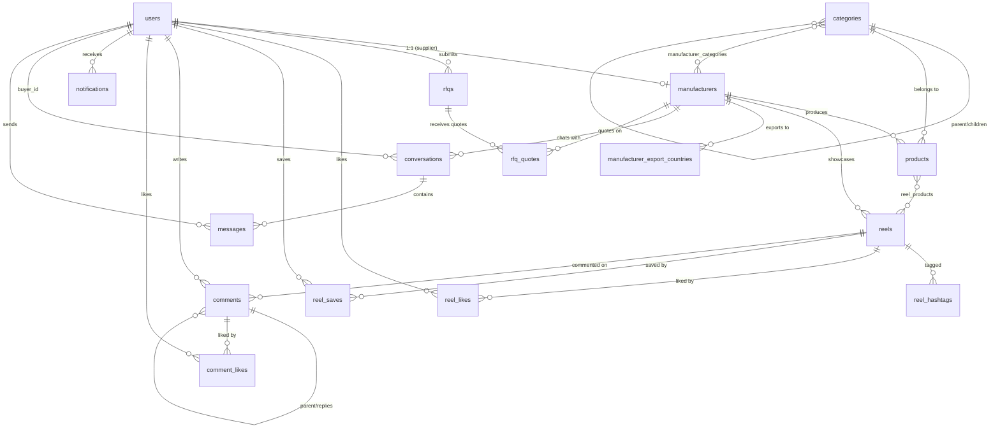

# SeekFactory Backend — Enterprise Architecture Guide (Part 2)

> **Continued from Part 1** — DTOs, Exceptions, Security, Services, Controllers, and API Map

---

## 9. DTOs (Request / Response)

> [!TIP]
> **Why DTOs?** Entities contain JPA annotations, lazy-loaded proxies, and bi-directional relationships. Sending them directly as JSON causes:
> - Infinite recursion (User → Manufacturer → User → ...)
> - Exposing internal fields (passwordHash, isActive flags)
> - Hibernate proxy serialization errors
>
> DTOs are clean, flat data objects that represent EXACTLY what the API consumer needs.

### 9.1 Common Response Wrappers

Every API response wraps data in a consistent envelope. This is industry standard.

#### `ApiResponse.java` — Success wrapper

```java
package seekfactory.axoraa.dto.response.common;

import com.fasterxml.jackson.annotation.JsonInclude;
import lombok.AllArgsConstructor;
import lombok.Builder;
import lombok.Data;
import lombok.NoArgsConstructor;

import java.time.OffsetDateTime;

/**
 * Standard API success response envelope.
 * 
 * Every successful response follows this structure:
 * {
 *   "success": true,
 *   "message": "Operation completed successfully",
 *   "data": { ... },
 *   "timestamp": "2026-09-04T18:30:00Z"
 * }
 *
 * @param <T> The type of the response payload
 */
@Data
@Builder
@NoArgsConstructor
@AllArgsConstructor
@JsonInclude(JsonInclude.Include.NON_NULL)
public class ApiResponse<T> {

    @Builder.Default
    private boolean success = true;

    private String message;

    private T data;

    @Builder.Default
    private OffsetDateTime timestamp = OffsetDateTime.now();

    // ─── Factory Methods ──────────────────────────────────────
    public static <T> ApiResponse<T> of(T data) {
        return ApiResponse.<T>builder()
                .data(data)
                .message("Success")
                .build();
    }

    public static <T> ApiResponse<T> of(T data, String message) {
        return ApiResponse.<T>builder()
                .data(data)
                .message(message)
                .build();
    }

    public static ApiResponse<Void> ok(String message) {
        return ApiResponse.<Void>builder()
                .message(message)
                .build();
    }
}
```

#### `ErrorResponse.java` — Error wrapper

```java
package seekfactory.axoraa.dto.response.common;

import com.fasterxml.jackson.annotation.JsonInclude;
import lombok.AllArgsConstructor;
import lombok.Builder;
import lombok.Data;
import lombok.NoArgsConstructor;

import java.time.OffsetDateTime;
import java.util.List;

/**
 * Standard API error response envelope.
 * 
 * {
 *   "success": false,
 *   "message": "Validation failed",
 *   "errors": ["Email is required", "Password must be at least 8 characters"],
 *   "status": 400,
 *   "timestamp": "2026-09-04T18:30:00Z"
 * }
 */
@Data
@Builder
@NoArgsConstructor
@AllArgsConstructor
@JsonInclude(JsonInclude.Include.NON_NULL)
public class ErrorResponse {

    @Builder.Default
    private boolean success = false;

    private String message;

    private List<String> errors;

    private int status;

    @Builder.Default
    private OffsetDateTime timestamp = OffsetDateTime.now();
}
```

#### `PagedResponse.java` — Paginated wrapper

```java
package seekfactory.axoraa.dto.response.common;

import lombok.AllArgsConstructor;
import lombok.Builder;
import lombok.Data;
import lombok.NoArgsConstructor;

import java.util.List;

/**
 * Standard paginated response envelope.
 * Used when returning large collections (products, reels, notifications).
 */
@Data
@Builder
@NoArgsConstructor
@AllArgsConstructor
public class PagedResponse<T> {

    private List<T> content;
    private int page;
    private int size;
    private long totalElements;
    private int totalPages;
    private boolean last;
}
```

### 9.2 Auth DTOs

#### `RegisterRequest.java`

```java
package seekfactory.axoraa.dto.request.auth;

import jakarta.validation.constraints.Email;
import jakarta.validation.constraints.NotBlank;
import jakarta.validation.constraints.Size;
import lombok.AllArgsConstructor;
import lombok.Builder;
import lombok.Data;
import lombok.NoArgsConstructor;

/**
 * Registration request payload for email-based signup.
 */
@Data
@Builder
@NoArgsConstructor
@AllArgsConstructor
public class RegisterRequest {

    @NotBlank(message = "Name is required")
    private String name;

    @NotBlank(message = "Email is required")
    @Email(message = "Please provide a valid email address")
    private String email;

    @NotBlank(message = "Password is required")
    @Size(min = 8, max = 128, message = "Password must be between 8 and 128 characters")
    private String password;

    @NotBlank(message = "Role is required")
    private String role;  // "Buyer" or "Supplier" — mapped to UserRole enum in service

    private String companyName;

    private String phone;

    private String industry;

    private String country;
}
```

#### `LoginRequest.java`

```java
package seekfactory.axoraa.dto.request.auth;

import jakarta.validation.constraints.Email;
import jakarta.validation.constraints.NotBlank;
import lombok.AllArgsConstructor;
import lombok.Builder;
import lombok.Data;
import lombok.NoArgsConstructor;

/**
 * Email + password login request.
 */
@Data
@Builder
@NoArgsConstructor
@AllArgsConstructor
public class LoginRequest {

    @NotBlank(message = "Email is required")
    @Email(message = "Please provide a valid email address")
    private String email;

    @NotBlank(message = "Password is required")
    private String password;
}
```

#### `PhoneLoginRequest.java`

```java
package seekfactory.axoraa.dto.request.auth;

import jakarta.validation.constraints.NotBlank;
import lombok.AllArgsConstructor;
import lombok.Builder;
import lombok.Data;
import lombok.NoArgsConstructor;

/**
 * Phone + OTP login request (mock OTP: "123456").
 */
@Data
@Builder
@NoArgsConstructor
@AllArgsConstructor
public class PhoneLoginRequest {

    @NotBlank(message = "Phone number is required")
    private String phone;

    @NotBlank(message = "OTP is required")
    private String otp;

    @NotBlank(message = "Role is required")
    private String role;

    private String companyName;
}
```

#### `GoogleAuthRequest.java`

```java
package seekfactory.axoraa.dto.request.auth;

import jakarta.validation.constraints.NotBlank;
import lombok.AllArgsConstructor;
import lombok.Builder;
import lombok.Data;
import lombok.NoArgsConstructor;

/**
 * Google OAuth2 login — frontend sends the Google ID token,
 * backend verifies it via Google API Client and extracts user info.
 */
@Data
@Builder
@NoArgsConstructor
@AllArgsConstructor
public class GoogleAuthRequest {

    @NotBlank(message = "Google ID token is required")
    private String idToken;

    @NotBlank(message = "Role is required")
    private String role;
}
```

#### `RefreshTokenRequest.java`

```java
package seekfactory.axoraa.dto.request.auth;

import jakarta.validation.constraints.NotBlank;
import lombok.AllArgsConstructor;
import lombok.Builder;
import lombok.Data;
import lombok.NoArgsConstructor;

@Data
@Builder
@NoArgsConstructor
@AllArgsConstructor
public class RefreshTokenRequest {

    @NotBlank(message = "Refresh token is required")
    private String refreshToken;
}
```

#### `AuthResponse.java` — Returned after successful authentication

```java
package seekfactory.axoraa.dto.response.auth;

import lombok.AllArgsConstructor;
import lombok.Builder;
import lombok.Data;
import lombok.NoArgsConstructor;

/**
 * JWT authentication response.
 * Contains access token (short-lived) and refresh token (long-lived).
 * Also includes basic user info so frontends can immediately populate the UI.
 */
@Data
@Builder
@NoArgsConstructor
@AllArgsConstructor
public class AuthResponse {

    private String accessToken;
    private String refreshToken;
    private String tokenType;
    private long expiresIn;

    // ─── User Info (avoids a separate /me call after login) ───
    private String userId;
    private String name;
    private String email;
    private String role;
    private String companyName;
    private String avatarUrl;
}
```

### 9.3 Entity Response DTOs

#### `UserResponse.java`

```java
package seekfactory.axoraa.dto.response.user;

import lombok.AllArgsConstructor;
import lombok.Builder;
import lombok.Data;
import lombok.NoArgsConstructor;

@Data
@Builder
@NoArgsConstructor
@AllArgsConstructor
public class UserResponse {

    private String id;
    private String name;
    private String email;
    private String role;        // "Buyer" or "Supplier" — mapped from UserRole enum
    private String avatarUrl;
    private String companyName;
    private String industry;
    private String country;
}
```

#### `ManufacturerResponse.java`

```java
package seekfactory.axoraa.dto.response.manufacturer;

import lombok.AllArgsConstructor;
import lombok.Builder;
import lombok.Data;
import lombok.NoArgsConstructor;

import java.util.List;

@Data
@Builder
@NoArgsConstructor
@AllArgsConstructor
public class ManufacturerResponse {

    private String id;
    private String slug;
    private String name;
    private String logoUrl;
    private String coverUrl;
    private String country;
    private String location;
    private boolean verified;
    private boolean premium;
    private int yearsEstablished;
    private String factorySize;
    private String employees;
    private List<String> exportCountries;
    private String description;
    private int followerCount;
    private List<String> categoryIds;
    private String chairmanName;
}
```

#### `ManufacturerDetailResponse.java`

```java
package seekfactory.axoraa.dto.response.manufacturer;

import lombok.AllArgsConstructor;
import lombok.Builder;
import lombok.Data;
import lombok.NoArgsConstructor;
import seekfactory.axoraa.dto.response.product.ProductResponse;
import seekfactory.axoraa.dto.response.reel.ReelResponse;

import java.util.List;

/**
 * Detailed manufacturer profile — includes the manufacturer's products and reels.
 * Used by the /manufacturers/{slug} detail page on both web and app.
 */
@Data
@Builder
@NoArgsConstructor
@AllArgsConstructor
public class ManufacturerDetailResponse {

    private ManufacturerResponse manufacturer;
    private List<ProductResponse> products;
    private List<ReelResponse> reels;
}
```

#### `ProductResponse.java`

```java
package seekfactory.axoraa.dto.response.product;

import lombok.AllArgsConstructor;
import lombok.Builder;
import lombok.Data;
import lombok.NoArgsConstructor;

import java.math.BigDecimal;
import java.util.Map;

@Data
@Builder
@NoArgsConstructor
@AllArgsConstructor
public class ProductResponse {

    private String id;
    private String slug;
    private String manufacturerId;
    private String name;
    private String imageUrl;
    private String description;
    private BigDecimal priceInr;
    private String unit;
    private String moq;
    private String categoryId;
    private Map<String, String> specs;
}
```

#### `ProductDetailResponse.java`

```java
package seekfactory.axoraa.dto.response.product;

import lombok.AllArgsConstructor;
import lombok.Builder;
import lombok.Data;
import lombok.NoArgsConstructor;
import seekfactory.axoraa.dto.response.manufacturer.ManufacturerResponse;

import java.util.List;

/**
 * Product detail — includes the manufacturing factory info and related products.
 */
@Data
@Builder
@NoArgsConstructor
@AllArgsConstructor
public class ProductDetailResponse {

    private ProductResponse product;
    private ManufacturerResponse manufacturer;
    private List<ProductResponse> related;
}
```

#### `ReelResponse.java`

```java
package seekfactory.axoraa.dto.response.reel;

import lombok.AllArgsConstructor;
import lombok.Builder;
import lombok.Data;
import lombok.NoArgsConstructor;

import java.util.List;

@Data
@Builder
@NoArgsConstructor
@AllArgsConstructor
public class ReelResponse {

    private String id;
    private String manufacturerId;
    private String title;
    private String description;
    private List<String> hashtags;
    private String posterUrl;
    private String videoUrl;
    private int durationSec;
    private int startSec;
    private long views;
    private int likes;
    private int comments;
    private int shares;
    private int saves;
    private String tab;          // "for-you" or "following"
    private List<String> productIds;
}
```

#### `FeedItemResponse.java`

```java
package seekfactory.axoraa.dto.response.reel;

import lombok.AllArgsConstructor;
import lombok.Builder;
import lombok.Data;
import lombok.NoArgsConstructor;
import seekfactory.axoraa.dto.response.manufacturer.ManufacturerResponse;

/**
 * A feed item = reel + its manufacturer info + optional primary product slug.
 * This is what the frontend FeedRepository.list() returns.
 */
@Data
@Builder
@NoArgsConstructor
@AllArgsConstructor
public class FeedItemResponse {

    private ReelResponse reel;
    private ManufacturerResponse manufacturer;
    private String primaryProductSlug;
}
```

#### `CategoryResponse.java`

```java
package seekfactory.axoraa.dto.response.category;

import lombok.AllArgsConstructor;
import lombok.Builder;
import lombok.Data;
import lombok.NoArgsConstructor;

@Data
@Builder
@NoArgsConstructor
@AllArgsConstructor
public class CategoryResponse {

    private String id;
    private String slug;
    private String name;
    private int listingCount;
    private String parentId;     // null for root categories
    private String icon;
}
```

#### `CommentResponse.java` & `CommentReplyResponse.java`

```java
package seekfactory.axoraa.dto.response.comment;

import lombok.AllArgsConstructor;
import lombok.Builder;
import lombok.Data;
import lombok.NoArgsConstructor;

import java.util.List;

@Data
@Builder
@NoArgsConstructor
@AllArgsConstructor
public class CommentResponse {

    private String id;
    private String reelId;
    private String authorName;
    private String authorAvatarUrl;
    private String authorCompany;
    private String authorCountry;
    private boolean isVerified;
    private String content;
    private String createdAt;
    private int likes;
    private List<CommentReplyResponse> replies;
}
```

```java
package seekfactory.axoraa.dto.response.comment;

import lombok.AllArgsConstructor;
import lombok.Builder;
import lombok.Data;
import lombok.NoArgsConstructor;

@Data
@Builder
@NoArgsConstructor
@AllArgsConstructor
public class CommentReplyResponse {

    private String id;
    private String authorName;
    private String authorAvatarUrl;
    private String authorCompany;
    private String authorCountry;
    private boolean isVerified;
    private String content;
    private String createdAt;
    private int likes;
}
```

#### `RfqResponse.java`

```java
package seekfactory.axoraa.dto.response.rfq;

import lombok.AllArgsConstructor;
import lombok.Builder;
import lombok.Data;
import lombok.NoArgsConstructor;

@Data
@Builder
@NoArgsConstructor
@AllArgsConstructor
public class RfqResponse {

    private String id;
    private String referenceNumber;
    private String productName;
    private String categoryId;
    private String quantity;
    private String unit;
    private String targetPrice;
    private String currency;
    private String incoterm;
    private String companyName;
    private String details;
    private String attachmentName;
    private String status;
    private String createdAt;
}
```

#### `ConversationResponse.java`

```java
package seekfactory.axoraa.dto.response.message;

import lombok.AllArgsConstructor;
import lombok.Builder;
import lombok.Data;
import lombok.NoArgsConstructor;
import seekfactory.axoraa.dto.response.manufacturer.ManufacturerResponse;

@Data
@Builder
@NoArgsConstructor
@AllArgsConstructor
public class ConversationResponse {

    private String id;
    private String manufacturerId;
    private String lastMessage;
    private String lastMessageAt;
    private int unreadCount;
    private ManufacturerResponse manufacturer;
}
```

#### `NotificationResponse.java`

```java
package seekfactory.axoraa.dto.response.notification;

import lombok.AllArgsConstructor;
import lombok.Builder;
import lombok.Data;
import lombok.NoArgsConstructor;

@Data
@Builder
@NoArgsConstructor
@AllArgsConstructor
public class NotificationResponse {

    private String id;
    private String title;
    private String body;
    private String createdAt;
    private boolean read;
}
```

### 9.4 Other Request DTOs

#### `RfqCreateRequest.java`

```java
package seekfactory.axoraa.dto.request.rfq;

import jakarta.validation.constraints.NotBlank;
import lombok.AllArgsConstructor;
import lombok.Builder;
import lombok.Data;
import lombok.NoArgsConstructor;

@Data
@Builder
@NoArgsConstructor
@AllArgsConstructor
public class RfqCreateRequest {

    @NotBlank(message = "Product name is required")
    private String productName;

    @NotBlank(message = "Quantity is required")
    private String quantity;

    @NotBlank(message = "Details are required")
    private String details;

    @NotBlank(message = "Company name is required")
    private String companyName;

    private String categoryId;
    private String unit;
    private String targetPrice;
    private String currency;     // "INR", "USD", etc.
    private String incoterm;     // "FOB", "CIF", etc.
    private String attachmentName;
    private String attachmentSize;
    private String attachmentUrl;
}
```

#### `CommentCreateRequest.java` & `ReplyCreateRequest.java`

```java
package seekfactory.axoraa.dto.request.comment;

import jakarta.validation.constraints.NotBlank;
import lombok.AllArgsConstructor;
import lombok.Builder;
import lombok.Data;
import lombok.NoArgsConstructor;

@Data
@Builder
@NoArgsConstructor
@AllArgsConstructor
public class CommentCreateRequest {

    @NotBlank(message = "Comment content is required")
    private String content;
}
```

```java
package seekfactory.axoraa.dto.request.comment;

import jakarta.validation.constraints.NotBlank;
import lombok.AllArgsConstructor;
import lombok.Builder;
import lombok.Data;
import lombok.NoArgsConstructor;

@Data
@Builder
@NoArgsConstructor
@AllArgsConstructor
public class ReplyCreateRequest {

    @NotBlank(message = "Reply content is required")
    private String content;
}
```

#### `MessageSendRequest.java`

```java
package seekfactory.axoraa.dto.request.message;

import jakarta.validation.constraints.NotBlank;
import lombok.AllArgsConstructor;
import lombok.Builder;
import lombok.Data;
import lombok.NoArgsConstructor;

@Data
@Builder
@NoArgsConstructor
@AllArgsConstructor
public class MessageSendRequest {

    @NotBlank(message = "Message text is required")
    private String messageText;

    private String attachmentName;
    private String attachmentSize;
    private String attachmentUrl;
}
```

#### `UserUpdateRequest.java`

```java
package seekfactory.axoraa.dto.request.user;

import lombok.AllArgsConstructor;
import lombok.Builder;
import lombok.Data;
import lombok.NoArgsConstructor;

@Data
@Builder
@NoArgsConstructor
@AllArgsConstructor
public class UserUpdateRequest {

    private String name;
    private String companyName;
    private String industry;
    private String country;
    private String phone;
    private String avatarUrl;
}
```

---

## 10. Exceptions & Global Error Handler

### 10.1 Custom Exception Classes

```java
// ResourceNotFoundException.java
package seekfactory.axoraa.exceptions;

import org.springframework.http.HttpStatus;
import org.springframework.web.bind.annotation.ResponseStatus;

/**
 * Thrown when a requested resource (user, product, manufacturer, etc.) does not exist.
 * Returns HTTP 404 Not Found.
 */
@ResponseStatus(HttpStatus.NOT_FOUND)
public class ResourceNotFoundException extends RuntimeException {

    public ResourceNotFoundException(String resourceName, String fieldName, String fieldValue) {
        super(String.format("%s not found with %s: '%s'", resourceName, fieldName, fieldValue));
    }

    public ResourceNotFoundException(String message) {
        super(message);
    }
}
```

```java
// DuplicateResourceException.java
package seekfactory.axoraa.exceptions;

import org.springframework.http.HttpStatus;
import org.springframework.web.bind.annotation.ResponseStatus;

/**
 * Thrown when attempting to create a resource that already exists.
 * Returns HTTP 409 Conflict.
 */
@ResponseStatus(HttpStatus.CONFLICT)
public class DuplicateResourceException extends RuntimeException {

    public DuplicateResourceException(String resourceName, String fieldName, String fieldValue) {
        super(String.format("%s already exists with %s: '%s'", resourceName, fieldName, fieldValue));
    }
}
```

```java
// UnauthorizedException.java
package seekfactory.axoraa.exceptions;

import org.springframework.http.HttpStatus;
import org.springframework.web.bind.annotation.ResponseStatus;

/**
 * Thrown when authentication credentials are missing or invalid.
 * Returns HTTP 401 Unauthorized.
 */
@ResponseStatus(HttpStatus.UNAUTHORIZED)
public class UnauthorizedException extends RuntimeException {

    public UnauthorizedException(String message) {
        super(message);
    }
}
```

```java
// ForbiddenException.java
package seekfactory.axoraa.exceptions;

import org.springframework.http.HttpStatus;
import org.springframework.web.bind.annotation.ResponseStatus;

/**
 * Thrown when an authenticated user lacks permission for the requested operation.
 * Returns HTTP 403 Forbidden.
 */
@ResponseStatus(HttpStatus.FORBIDDEN)
public class ForbiddenException extends RuntimeException {

    public ForbiddenException(String message) {
        super(message);
    }
}
```

```java
// BadRequestException.java
package seekfactory.axoraa.exceptions;

import org.springframework.http.HttpStatus;
import org.springframework.web.bind.annotation.ResponseStatus;

/**
 * Thrown when the request payload is malformed or contains invalid data.
 * Returns HTTP 400 Bad Request.
 */
@ResponseStatus(HttpStatus.BAD_REQUEST)
public class BadRequestException extends RuntimeException {

    public BadRequestException(String message) {
        super(message);
    }
}
```

```java
// TokenExpiredException.java
package seekfactory.axoraa.exceptions;

import org.springframework.http.HttpStatus;
import org.springframework.web.bind.annotation.ResponseStatus;

/**
 * Thrown when a JWT token has expired.
 * Returns HTTP 401 Unauthorized.
 */
@ResponseStatus(HttpStatus.UNAUTHORIZED)
public class TokenExpiredException extends RuntimeException {

    public TokenExpiredException(String message) {
        super(message);
    }
}
```

### 10.2 `GlobalExceptionHandler.java`

```java
package seekfactory.axoraa.exceptions;

import org.springframework.http.HttpStatus;
import org.springframework.http.ResponseEntity;
import org.springframework.security.access.AccessDeniedException;
import org.springframework.validation.FieldError;
import org.springframework.web.bind.MethodArgumentNotValidException;
import org.springframework.web.bind.annotation.ExceptionHandler;
import org.springframework.web.bind.annotation.RestControllerAdvice;
import seekfactory.axoraa.dto.response.common.ErrorResponse;

import java.util.List;

/**
 * Global exception handler that converts all exceptions into consistent
 * ErrorResponse JSON objects. This ensures the frontend always receives
 * a predictable error format regardless of what went wrong.
 *
 * Priority order: specific handlers first, then generic fallback.
 */
@RestControllerAdvice
public class GlobalExceptionHandler {

    @ExceptionHandler(ResourceNotFoundException.class)
    public ResponseEntity<ErrorResponse> handleNotFound(ResourceNotFoundException ex) {
        return buildResponse(HttpStatus.NOT_FOUND, ex.getMessage());
    }

    @ExceptionHandler(DuplicateResourceException.class)
    public ResponseEntity<ErrorResponse> handleConflict(DuplicateResourceException ex) {
        return buildResponse(HttpStatus.CONFLICT, ex.getMessage());
    }

    @ExceptionHandler({UnauthorizedException.class, TokenExpiredException.class})
    public ResponseEntity<ErrorResponse> handleUnauthorized(RuntimeException ex) {
        return buildResponse(HttpStatus.UNAUTHORIZED, ex.getMessage());
    }

    @ExceptionHandler(ForbiddenException.class)
    public ResponseEntity<ErrorResponse> handleForbidden(ForbiddenException ex) {
        return buildResponse(HttpStatus.FORBIDDEN, ex.getMessage());
    }

    @ExceptionHandler(BadRequestException.class)
    public ResponseEntity<ErrorResponse> handleBadRequest(BadRequestException ex) {
        return buildResponse(HttpStatus.BAD_REQUEST, ex.getMessage());
    }

    @ExceptionHandler(AccessDeniedException.class)
    public ResponseEntity<ErrorResponse> handleAccessDenied(AccessDeniedException ex) {
        return buildResponse(HttpStatus.FORBIDDEN, "You do not have permission to perform this action");
    }

    /**
     * Handles @Valid validation failures.
     * Extracts field-level error messages and returns them as a list.
     */
    @ExceptionHandler(MethodArgumentNotValidException.class)
    public ResponseEntity<ErrorResponse> handleValidation(MethodArgumentNotValidException ex) {
        List<String> errors = ex.getBindingResult()
                .getFieldErrors()
                .stream()
                .map(FieldError::getDefaultMessage)
                .toList();

        ErrorResponse response = ErrorResponse.builder()
                .message("Validation failed")
                .errors(errors)
                .status(HttpStatus.BAD_REQUEST.value())
                .build();

        return ResponseEntity.status(HttpStatus.BAD_REQUEST).body(response);
    }

    /**
     * Catch-all handler for any unhandled exceptions.
     * Logs the error and returns a generic 500 response.
     */
    @ExceptionHandler(Exception.class)
    public ResponseEntity<ErrorResponse> handleGeneral(Exception ex) {
        // In production, log this: log.error("Unhandled exception", ex);
        return buildResponse(HttpStatus.INTERNAL_SERVER_ERROR,
                "An unexpected error occurred. Please try again later.");
    }

    // ─── Helper ───────────────────────────────────────────────
    private ResponseEntity<ErrorResponse> buildResponse(HttpStatus status, String message) {
        ErrorResponse response = ErrorResponse.builder()
                .message(message)
                .status(status.value())
                .build();
        return ResponseEntity.status(status).body(response);
    }
}
```

---

## 11. Security Configuration (JWT + Google OAuth)

### 11.1 `JwtConfig.java` — Properties

```java
package seekfactory.axoraa.config;

import lombok.Getter;
import lombok.Setter;
import org.springframework.boot.context.properties.ConfigurationProperties;
import org.springframework.stereotype.Component;

/**
 * Binds the app.jwt.* properties from application.yaml.
 * Used by JwtTokenProvider to sign and validate tokens.
 */
@Component
@ConfigurationProperties(prefix = "app.jwt")
@Getter
@Setter
public class JwtConfig {

    private String secret;
    private long accessTokenExpiry;
    private long refreshTokenExpiry;
    private String issuer;
}
```

### 11.2 `JwtTokenProvider.java`

```java
package seekfactory.axoraa.utils;

import io.jsonwebtoken.*;
import io.jsonwebtoken.io.Decoders;
import io.jsonwebtoken.security.Keys;
import lombok.RequiredArgsConstructor;
import org.springframework.stereotype.Component;
import seekfactory.axoraa.config.JwtConfig;

import javax.crypto.SecretKey;
import java.util.Date;

/**
 * Centralized JWT utility for token generation, validation, and claim extraction.
 *
 * Generates two types of tokens:
 * - Access Token (short-lived, 24h default) — sent with every API request
 * - Refresh Token (long-lived, 7d default) — used to get new access tokens
 */
@Component
@RequiredArgsConstructor
public class JwtTokenProvider {

    private final JwtConfig jwtConfig;

    /**
     * Generate an access token for the given user.
     */
    public String generateAccessToken(String userId, String email, String role) {
        return buildToken(userId, email, role, jwtConfig.getAccessTokenExpiry());
    }

    /**
     * Generate a refresh token for the given user.
     */
    public String generateRefreshToken(String userId, String email, String role) {
        return buildToken(userId, email, role, jwtConfig.getRefreshTokenExpiry());
    }

    /**
     * Validate a token and return true if it is valid and not expired.
     */
    public boolean validateToken(String token) {
        try {
            getClaims(token);
            return true;
        } catch (JwtException | IllegalArgumentException e) {
            return false;
        }
    }

    /**
     * Extract the user ID (subject) from a valid token.
     */
    public String getUserIdFromToken(String token) {
        return getClaims(token).getSubject();
    }

    /**
     * Extract the user's email from a valid token.
     */
    public String getEmailFromToken(String token) {
        return getClaims(token).get("email", String.class);
    }

    /**
     * Extract the user's role from a valid token.
     */
    public String getRoleFromToken(String token) {
        return getClaims(token).get("role", String.class);
    }

    // ─── Private Helpers ──────────────────────────────────────

    private String buildToken(String userId, String email, String role, long expiry) {
        Date now = new Date();
        Date expiryDate = new Date(now.getTime() + expiry);

        return Jwts.builder()
                .subject(userId)
                .claim("email", email)
                .claim("role", role)
                .issuer(jwtConfig.getIssuer())
                .issuedAt(now)
                .expiration(expiryDate)
                .signWith(getSigningKey())
                .compact();
    }

    private Claims getClaims(String token) {
        return Jwts.parser()
                .verifyWith(getSigningKey())
                .build()
                .parseSignedClaims(token)
                .getPayload();
    }

    private SecretKey getSigningKey() {
        byte[] keyBytes = Decoders.BASE64.decode(jwtConfig.getSecret());
        return Keys.hmacShaKeyFor(keyBytes);
    }
}
```

### 11.3 `JwtAuthenticationFilter.java`

```java
package seekfactory.axoraa.config;

import jakarta.servlet.FilterChain;
import jakarta.servlet.ServletException;
import jakarta.servlet.http.HttpServletRequest;
import jakarta.servlet.http.HttpServletResponse;
import lombok.RequiredArgsConstructor;
import org.springframework.security.authentication.UsernamePasswordAuthenticationToken;
import org.springframework.security.core.authority.SimpleGrantedAuthority;
import org.springframework.security.core.context.SecurityContextHolder;
import org.springframework.stereotype.Component;
import org.springframework.util.StringUtils;
import org.springframework.web.filter.OncePerRequestFilter;
import seekfactory.axoraa.utils.JwtTokenProvider;

import java.io.IOException;
import java.util.List;

/**
 * JWT Authentication Filter — runs ONCE per request.
 *
 * Workflow:
 * 1. Extract Bearer token from Authorization header
 * 2. Validate the token (signature + expiry)
 * 3. Extract user ID and role from token claims
 * 4. Set authentication in SecurityContext so controllers can use @AuthenticationPrincipal
 *
 * If no token is present, the request proceeds unauthenticated (anonymous).
 * If token is invalid/expired, the request proceeds unauthenticated (Spring Security will reject if endpoint requires auth).
 */
@Component
@RequiredArgsConstructor
public class JwtAuthenticationFilter extends OncePerRequestFilter {

    private final JwtTokenProvider jwtTokenProvider;

    @Override
    protected void doFilterInternal(HttpServletRequest request,
                                    HttpServletResponse response,
                                    FilterChain filterChain) throws ServletException, IOException {

        String token = extractTokenFromHeader(request);

        if (StringUtils.hasText(token) && jwtTokenProvider.validateToken(token)) {
            String userId = jwtTokenProvider.getUserIdFromToken(token);
            String role = jwtTokenProvider.getRoleFromToken(token);

            // Create authentication object with the user's granted authority
            UsernamePasswordAuthenticationToken authentication =
                    new UsernamePasswordAuthenticationToken(
                            userId,                                          // principal = userId
                            null,                                            // credentials (not needed with JWT)
                            List.of(new SimpleGrantedAuthority(role))        // authorities
                    );

            // Set in SecurityContext — available via SecurityContextHolder throughout the request
            SecurityContextHolder.getContext().setAuthentication(authentication);
        }

        filterChain.doFilter(request, response);
    }

    /**
     * Extracts the JWT from the "Authorization: Bearer <token>" header.
     */
    private String extractTokenFromHeader(HttpServletRequest request) {
        String bearerToken = request.getHeader("Authorization");
        if (StringUtils.hasText(bearerToken) && bearerToken.startsWith("Bearer ")) {
            return bearerToken.substring(7);
        }
        return null;
    }
}
```

### 11.4 `SecurityConfig.java`

```java
package seekfactory.axoraa.config;

import lombok.RequiredArgsConstructor;
import org.springframework.context.annotation.Bean;
import org.springframework.context.annotation.Configuration;
import org.springframework.http.HttpMethod;
import org.springframework.security.config.annotation.method.configuration.EnableMethodSecurity;
import org.springframework.security.config.annotation.web.builders.HttpSecurity;
import org.springframework.security.config.annotation.web.configuration.EnableWebSecurity;
import org.springframework.security.config.http.SessionCreationPolicy;
import org.springframework.security.crypto.bcrypt.BCryptPasswordEncoder;
import org.springframework.security.crypto.password.PasswordEncoder;
import org.springframework.security.web.SecurityFilterChain;
import org.springframework.security.web.authentication.UsernamePasswordAuthenticationFilter;

/**
 * Central security configuration.
 *
 * Defines three access tiers:
 * 1. PUBLIC — No authentication needed (auth endpoints, feed, categories, public profiles)
 * 2. AUTHENTICATED — Any logged-in user (RFQ, messages, notifications, profile)
 * 3. ADMIN — Only ROLE_ADMIN users (user management, verifications)
 */
@Configuration
@EnableWebSecurity
@EnableMethodSecurity                    // Enables @PreAuthorize on methods
@RequiredArgsConstructor
public class SecurityConfig {

    private final JwtAuthenticationFilter jwtAuthenticationFilter;

    @Bean
    public SecurityFilterChain filterChain(HttpSecurity http) throws Exception {
        http
            // Disable CSRF (stateless JWT, no cookies for auth)
            .csrf(csrf -> csrf.disable())

            // Stateless session — no server-side session
            .sessionManagement(session ->
                session.sessionCreationPolicy(SessionCreationPolicy.STATELESS)
            )

            // Endpoint access rules
            .authorizeHttpRequests(auth -> auth
                // ─── PUBLIC ENDPOINTS (no auth required) ──────────────
                .requestMatchers("/api/v1/auth/**").permitAll()
                .requestMatchers(HttpMethod.GET, "/api/v1/feed/**").permitAll()
                .requestMatchers(HttpMethod.GET, "/api/v1/categories/**").permitAll()
                .requestMatchers(HttpMethod.GET, "/api/v1/manufacturers/**").permitAll()
                .requestMatchers(HttpMethod.GET, "/api/v1/products/**").permitAll()
                .requestMatchers(HttpMethod.GET, "/api/v1/reels/*/comments").permitAll()

                // Swagger / OpenAPI / Actuator
                .requestMatchers("/swagger-ui/**", "/api-docs/**", "/v3/api-docs/**").permitAll()
                .requestMatchers("/actuator/health", "/actuator/info").permitAll()

                // ─── ADMIN-ONLY ENDPOINTS ─────────────────────────────
                .requestMatchers("/api/v1/admin/**").hasAuthority("ROLE_ADMIN")

                // ─── ALL OTHER ENDPOINTS REQUIRE AUTHENTICATION ───────
                .anyRequest().authenticated()
            )

            // Add JWT filter BEFORE Spring's default UsernamePasswordAuthenticationFilter
            .addFilterBefore(jwtAuthenticationFilter, UsernamePasswordAuthenticationFilter.class);

        return http.build();
    }

    /**
     * BCrypt password encoder — industry standard for password hashing.
     * BCrypt automatically salts passwords and is resistant to rainbow table attacks.
     */
    @Bean
    public PasswordEncoder passwordEncoder() {
        return new BCryptPasswordEncoder(12);  // strength = 12 rounds
    }
}
```

### 11.5 `CorsConfig.java`

```java
package seekfactory.axoraa.config;

import lombok.RequiredArgsConstructor;
import org.springframework.boot.context.properties.ConfigurationProperties;
import org.springframework.context.annotation.Bean;
import org.springframework.context.annotation.Configuration;
import org.springframework.web.cors.CorsConfiguration;
import org.springframework.web.cors.CorsConfigurationSource;
import org.springframework.web.cors.UrlBasedCorsConfigurationSource;

import java.util.List;

/**
 * CORS configuration allowing requests from both the Next.js web app
 * and Expo mobile app development servers, plus production domains.
 */
@Configuration
@RequiredArgsConstructor
public class CorsConfig {

    @Bean
    public CorsConfigurationSource corsConfigurationSource() {
        CorsConfiguration config = new CorsConfiguration();

        // Allowed origins (web + app dev servers + production)
        config.setAllowedOrigins(List.of(
                "http://localhost:3000",        // Next.js dev
                "http://localhost:8081",        // Expo dev
                "https://seekfactory.com",
                "https://www.seekfactory.com"
        ));

        config.setAllowedMethods(List.of("GET", "POST", "PUT", "PATCH", "DELETE", "OPTIONS"));
        config.setAllowedHeaders(List.of("*"));
        config.setAllowCredentials(true);
        config.setMaxAge(3600L);    // Cache preflight for 1 hour

        UrlBasedCorsConfigurationSource source = new UrlBasedCorsConfigurationSource();
        source.registerCorsConfiguration("/api/**", config);
        return source;
    }
}
```

---

## 12. Utility Classes

### 12.1 `SecurityUtils.java`

```java
package seekfactory.axoraa.utils;

import org.springframework.security.core.Authentication;
import org.springframework.security.core.context.SecurityContextHolder;
import seekfactory.axoraa.exceptions.UnauthorizedException;

/**
 * Utility to extract the current authenticated user's info from the SecurityContext.
 * Used by service methods that need to know "who is making this request?"
 */
public final class SecurityUtils {

    private SecurityUtils() {} // Utility class — no instantiation

    /**
     * Returns the current authenticated user's ID.
     * Throws UnauthorizedException if no authentication is present.
     */
    public static String getCurrentUserId() {
        Authentication authentication = SecurityContextHolder.getContext().getAuthentication();
        if (authentication == null || !authentication.isAuthenticated()) {
            throw new UnauthorizedException("User is not authenticated");
        }
        return (String) authentication.getPrincipal();
    }

    /**
     * Returns the current user's role (e.g., "ROLE_BUYER").
     */
    public static String getCurrentUserRole() {
        Authentication authentication = SecurityContextHolder.getContext().getAuthentication();
        if (authentication == null || authentication.getAuthorities().isEmpty()) {
            throw new UnauthorizedException("User is not authenticated");
        }
        return authentication.getAuthorities().iterator().next().getAuthority();
    }
}
```

### 12.2 `SlugUtils.java`

```java
package seekfactory.axoraa.utils;

import java.text.Normalizer;
import java.util.Locale;
import java.util.regex.Pattern;

/**
 * Generates URL-safe slugs from display names.
 * Example: "Apex Forgings Pvt. Ltd." → "apex-forgings-pvt-ltd"
 */
public final class SlugUtils {

    private static final Pattern NON_LATIN = Pattern.compile("[^\\w-]");
    private static final Pattern WHITESPACE = Pattern.compile("[\\s]");

    private SlugUtils() {}

    public static String toSlug(String input) {
        if (input == null || input.isBlank()) {
            return "";
        }
        String normalized = Normalizer.normalize(input, Normalizer.Form.NFD);
        String slug = WHITESPACE.matcher(normalized).replaceAll("-");
        slug = NON_LATIN.matcher(slug).replaceAll("");
        slug = slug.toLowerCase(Locale.ENGLISH);
        slug = slug.replaceAll("-{2,}", "-");       // collapse multiple hyphens
        slug = slug.replaceAll("^-|-$", "");        // trim leading/trailing hyphens
        return slug;
    }
}
```

### 12.3 `IdGenerator.java`

```java
package seekfactory.axoraa.utils;

import java.util.UUID;

/**
 * Centralized ID generation utility.
 * Currently uses UUID v4. Can be swapped to ULID/TSID for time-sorted IDs.
 */
public final class IdGenerator {

    private IdGenerator() {}

    public static String generateId() {
        return UUID.randomUUID().toString();
    }

    /**
     * Generates an RFQ reference number like "RFQ-2026-000142".
     */
    public static String generateRfqReference(int year, int sequence) {
        return String.format("RFQ-%d-%06d", year, sequence);
    }
}
```

---

## 13. Configuration Classes

### 13.1 `ModelMapperConfig.java`

```java
package seekfactory.axoraa.config;

import org.modelmapper.ModelMapper;
import org.modelmapper.convention.MatchingStrategies;
import org.springframework.context.annotation.Bean;
import org.springframework.context.annotation.Configuration;

/**
 * Configures ModelMapper for Entity <-> DTO mapping.
 *
 * Uses STRICT matching strategy to prevent accidental field mapping
 * between similarly-named but semantically different fields.
 */
@Configuration
public class ModelMapperConfig {

    @Bean
    public ModelMapper modelMapper() {
        ModelMapper mapper = new ModelMapper();
        mapper.getConfiguration()
                .setMatchingStrategy(MatchingStrategies.STRICT)
                .setSkipNullEnabled(true)
                .setFieldMatchingEnabled(true)
                .setFieldAccessLevel(org.modelmapper.config.Configuration.AccessLevel.PRIVATE);
        return mapper;
    }
}
```

### 13.2 `OpenApiConfig.java`

```java
package seekfactory.axoraa.config;

import io.swagger.v3.oas.models.Components;
import io.swagger.v3.oas.models.OpenAPI;
import io.swagger.v3.oas.models.info.Contact;
import io.swagger.v3.oas.models.info.Info;
import io.swagger.v3.oas.models.security.SecurityRequirement;
import io.swagger.v3.oas.models.security.SecurityScheme;
import org.springframework.context.annotation.Bean;
import org.springframework.context.annotation.Configuration;

/**
 * OpenAPI / Swagger configuration.
 *
 * Adds JWT Bearer authentication scheme so you can test protected
 * endpoints directly from the Swagger UI at /swagger-ui.html.
 */
@Configuration
public class OpenApiConfig {

    @Bean
    public OpenAPI customOpenAPI() {
        return new OpenAPI()
                .info(new Info()
                        .title("SeekFactory API")
                        .version("1.0.0")
                        .description("India-China B2B Manufacturing Marketplace REST API")
                        .contact(new Contact()
                                .name("Axoraa Team")
                                .email("api@seekfactory.com")))
                .addSecurityItem(new SecurityRequirement().addList("Bearer Authentication"))
                .components(new Components()
                        .addSecuritySchemes("Bearer Authentication",
                                new SecurityScheme()
                                        .name("Bearer Authentication")
                                        .type(SecurityScheme.Type.HTTP)
                                        .scheme("bearer")
                                        .bearerFormat("JWT")));
    }
}
```

---

## 14. Service Interfaces

### 14.1 `AuthService.java`

```java
package seekfactory.axoraa.services;

import seekfactory.axoraa.dto.request.auth.*;
import seekfactory.axoraa.dto.response.auth.AuthResponse;

public interface AuthService {

    AuthResponse register(RegisterRequest request);

    AuthResponse login(LoginRequest request);

    AuthResponse loginWithPhone(PhoneLoginRequest request);

    AuthResponse loginWithGoogle(GoogleAuthRequest request);

    AuthResponse refreshToken(RefreshTokenRequest request);

    void logout(String userId);
}
```

### 14.2 `UserService.java`

```java
package seekfactory.axoraa.services;

import seekfactory.axoraa.dto.request.user.UserUpdateRequest;
import seekfactory.axoraa.dto.response.user.UserResponse;

public interface UserService {

    UserResponse getCurrentUser(String userId);

    UserResponse updateProfile(String userId, UserUpdateRequest request);

    void deactivateUser(String userId);
}
```

### 14.3 `ManufacturerService.java`

```java
package seekfactory.axoraa.services;

import seekfactory.axoraa.dto.response.manufacturer.ManufacturerDetailResponse;
import seekfactory.axoraa.dto.response.manufacturer.ManufacturerResponse;

import java.util.List;

public interface ManufacturerService {

    List<ManufacturerResponse> listVerified(int limit);

    ManufacturerDetailResponse getBySlug(String slug);

    List<ManufacturerResponse> listAll();
}
```

### 14.4 `ProductService.java`

```java
package seekfactory.axoraa.services;

import seekfactory.axoraa.dto.response.product.ProductDetailResponse;
import seekfactory.axoraa.dto.response.product.ProductResponse;

import java.util.List;

public interface ProductService {

    List<ProductResponse> listTrending(int limit);

    ProductDetailResponse getBySlug(String slug);

    List<ProductResponse> listByCategory(String categoryId);
}
```

### 14.5 `ReelService.java`

```java
package seekfactory.axoraa.services;

import seekfactory.axoraa.dto.response.reel.FeedItemResponse;
import seekfactory.axoraa.enums.FeedTab;

import java.util.List;

public interface ReelService {

    List<FeedItemResponse> getFeed(FeedTab tab);
}
```

### 14.6 `CategoryService.java`

```java
package seekfactory.axoraa.services;

import seekfactory.axoraa.dto.response.category.CategoryResponse;

import java.util.List;

public interface CategoryService {

    List<CategoryResponse> listAll();

    List<CategoryResponse> listRoots();

    List<CategoryResponse> listChildren(String parentIdOrSlug);

    CategoryResponse getBySlug(String slug);
}
```

### 14.7 `CommentService.java`

```java
package seekfactory.axoraa.services;

import seekfactory.axoraa.dto.request.comment.CommentCreateRequest;
import seekfactory.axoraa.dto.request.comment.ReplyCreateRequest;
import seekfactory.axoraa.dto.response.comment.CommentResponse;
import seekfactory.axoraa.dto.response.comment.CommentReplyResponse;

import java.util.List;

public interface CommentService {

    List<CommentResponse> listByReelId(String reelId);

    CommentResponse addComment(String reelId, String userId, CommentCreateRequest request);

    CommentReplyResponse addReply(String commentId, String userId, ReplyCreateRequest request);
}
```

### 14.8 `RfqService.java`

```java
package seekfactory.axoraa.services;

import seekfactory.axoraa.dto.request.rfq.RfqCreateRequest;
import seekfactory.axoraa.dto.response.rfq.RfqResponse;

import java.util.List;

public interface RfqService {

    RfqResponse submit(String userId, RfqCreateRequest request);

    List<RfqResponse> listByUser(String userId);
}
```

### 14.9 `ConversationService.java`

```java
package seekfactory.axoraa.services;

import seekfactory.axoraa.dto.response.message.ConversationResponse;

import java.util.List;

public interface ConversationService {

    List<ConversationResponse> listRecent(String userId, int limit);
}
```

### 14.10 `NotificationService.java`

```java
package seekfactory.axoraa.services;

import seekfactory.axoraa.dto.response.notification.NotificationResponse;

import java.util.List;

public interface NotificationService {

    List<NotificationResponse> listByUser(String userId);

    long unreadCount(String userId);

    void markAllAsRead(String userId);
}
```

---

## 15. Complete REST API Endpoint Map

This is the contract between your backend and both frontends. Every API call both frontends make maps to one of these endpoints.

| # | Method | Endpoint | Access | Controller | Description |
|---|--------|----------|--------|------------|-------------|
| **Auth** |||||
| 1 | POST | `/api/v1/auth/register` | PUBLIC | AuthController | Email + password registration |
| 2 | POST | `/api/v1/auth/login` | PUBLIC | AuthController | Email + password login |
| 3 | POST | `/api/v1/auth/login/phone` | PUBLIC | AuthController | Phone + OTP login |
| 4 | POST | `/api/v1/auth/google` | PUBLIC | AuthController | Google OAuth2 login |
| 5 | POST | `/api/v1/auth/refresh` | PUBLIC | AuthController | Refresh access token |
| 6 | POST | `/api/v1/auth/logout` | AUTH | AuthController | Invalidate session |
| 7 | GET | `/api/v1/auth/me` | AUTH | AuthController | Get current user profile |
| **Feed** |||||
| 8 | GET | `/api/v1/feed?tab=for-you` | PUBLIC | FeedController | Get reels feed by tab |
| **Categories** |||||
| 9 | GET | `/api/v1/categories` | PUBLIC | CategoryController | List all categories |
| 10 | GET | `/api/v1/categories/roots` | PUBLIC | CategoryController | List root categories only |
| 11 | GET | `/api/v1/categories/{slug}/children` | PUBLIC | CategoryController | List subcategories |
| 12 | GET | `/api/v1/categories/{slug}` | PUBLIC | CategoryController | Get category by slug |
| **Manufacturers** |||||
| 13 | GET | `/api/v1/manufacturers` | PUBLIC | ManufacturerController | List all manufacturers |
| 14 | GET | `/api/v1/manufacturers/verified` | PUBLIC | ManufacturerController | List verified factories |
| 15 | GET | `/api/v1/manufacturers/{slug}` | PUBLIC | ManufacturerController | Factory detail (+ products + reels) |
| **Products** |||||
| 16 | GET | `/api/v1/products/trending` | PUBLIC | ProductController | Trending products |
| 17 | GET | `/api/v1/products/{slug}` | PUBLIC | ProductController | Product detail (+ manufacturer + related) |
| 18 | GET | `/api/v1/products/category/{categoryId}` | PUBLIC | ProductController | Products by category |
| **Comments** |||||
| 19 | GET | `/api/v1/reels/{reelId}/comments` | PUBLIC | CommentController | List comments for a reel |
| 20 | POST | `/api/v1/reels/{reelId}/comments` | AUTH | CommentController | Add a new comment |
| 21 | POST | `/api/v1/comments/{commentId}/replies` | AUTH | CommentController | Reply to a comment |
| **RFQ** |||||
| 22 | POST | `/api/v1/rfqs` | AUTH | RfqController | Submit a new RFQ |
| 23 | GET | `/api/v1/rfqs` | AUTH | RfqController | List user's RFQs |
| **Messages** |||||
| 24 | GET | `/api/v1/conversations` | AUTH | ConversationController | List recent conversations |
| 25 | GET | `/api/v1/conversations/{id}/messages` | AUTH | ConversationController | Get messages in conversation |
| 26 | POST | `/api/v1/conversations/{id}/messages` | AUTH | ConversationController | Send a message |
| **Notifications** |||||
| 27 | GET | `/api/v1/notifications` | AUTH | NotificationController | List user's notifications |
| 28 | GET | `/api/v1/notifications/unread-count` | AUTH | NotificationController | Get unread count |
| 29 | PUT | `/api/v1/notifications/mark-read` | AUTH | NotificationController | Mark all as read |
| **User Profile** |||||
| 30 | GET | `/api/v1/users/me` | AUTH | UserController | Get own profile |
| 31 | PUT | `/api/v1/users/me` | AUTH | UserController | Update own profile |
| **Admin** |||||
| 32 | GET | `/api/v1/admin/users` | ADMIN | AdminController | List all users |
| 33 | PUT | `/api/v1/admin/users/{id}/activate` | ADMIN | AdminController | Activate/deactivate user |
| 34 | PUT | `/api/v1/admin/manufacturers/{id}/verify` | ADMIN | AdminController | Verify a manufacturer |

---

## 16. Example Service Implementation — `AuthServiceImpl.java`

Here is the most complex service to demonstrate the pattern. All other services follow the same structure.

```java
package seekfactory.axoraa.services.serviceImpl;

import lombok.RequiredArgsConstructor;
import lombok.extern.slf4j.Slf4j;
import org.springframework.security.crypto.password.PasswordEncoder;
import org.springframework.stereotype.Service;
import org.springframework.transaction.annotation.Transactional;
import seekfactory.axoraa.config.JwtConfig;
import seekfactory.axoraa.dto.request.auth.*;
import seekfactory.axoraa.dto.response.auth.AuthResponse;
import seekfactory.axoraa.entity.User;
import seekfactory.axoraa.enums.AuthProvider;
import seekfactory.axoraa.enums.UserRole;
import seekfactory.axoraa.exceptions.BadRequestException;
import seekfactory.axoraa.exceptions.DuplicateResourceException;
import seekfactory.axoraa.exceptions.ResourceNotFoundException;
import seekfactory.axoraa.exceptions.UnauthorizedException;
import seekfactory.axoraa.repository.UserRepository;
import seekfactory.axoraa.services.AuthService;
import seekfactory.axoraa.utils.JwtTokenProvider;

/**
 * Enterprise-grade authentication service.
 *
 * Supports three login methods:
 * 1. Email + Password (LOCAL provider)
 * 2. Phone + OTP (PHONE provider) — mock OTP "123456" for development
 * 3. Google OAuth2 (GOOGLE provider) — verifies Google ID tokens
 */
@Slf4j
@Service
@RequiredArgsConstructor
@Transactional
public class AuthServiceImpl implements AuthService {

    private final UserRepository userRepository;
    private final PasswordEncoder passwordEncoder;
    private final JwtTokenProvider jwtTokenProvider;
    private final JwtConfig jwtConfig;

    @Override
    public AuthResponse register(RegisterRequest request) {
        // 1. Check for existing email
        if (userRepository.existsByEmail(request.getEmail())) {
            throw new DuplicateResourceException("User", "email", request.getEmail());
        }

        // 2. Map role string to enum
        UserRole role = mapRole(request.getRole());

        // 3. Build user entity
        User user = User.builder()
                .name(request.getName())
                .email(request.getEmail())
                .passwordHash(passwordEncoder.encode(request.getPassword()))
                .role(role)
                .authProvider(AuthProvider.LOCAL)
                .companyName(request.getCompanyName())
                .phone(request.getPhone())
                .industry(request.getIndustry())
                .country(request.getCountry())
                .build();

        // 4. Save to database
        User savedUser = userRepository.save(user);
        log.info("New user registered: {} ({})", savedUser.getEmail(), savedUser.getRole());

        // 5. Generate JWT tokens and return
        return buildAuthResponse(savedUser);
    }

    @Override
    @Transactional(readOnly = true)
    public AuthResponse login(LoginRequest request) {
        // 1. Find user by email
        User user = userRepository.findByEmail(request.getEmail())
                .orElseThrow(() -> new UnauthorizedException("Invalid email or password"));

        // 2. Verify password
        if (!passwordEncoder.matches(request.getPassword(), user.getPasswordHash())) {
            throw new UnauthorizedException("Invalid email or password");
        }

        // 3. Check if account is active
        if (!user.getIsActive()) {
            throw new UnauthorizedException("Account has been deactivated");
        }

        log.info("User logged in: {} ({})", user.getEmail(), user.getRole());
        return buildAuthResponse(user);
    }

    @Override
    public AuthResponse loginWithPhone(PhoneLoginRequest request) {
        // In production, verify OTP via SMS provider (Twilio, MSG91, etc.)
        // For development, accept mock OTP "123456"
        if (!"123456".equals(request.getOtp())) {
            throw new UnauthorizedException("Invalid OTP");
        }

        // Find or create user by phone
        User user = userRepository.findByPhone(request.getPhone())
                .orElseGet(() -> {
                    // Auto-register on first phone login
                    User newUser = User.builder()
                            .phone(request.getPhone())
                            .name("User " + request.getPhone().substring(
                                    Math.max(0, request.getPhone().length() - 4)))
                            .role(mapRole(request.getRole()))
                            .authProvider(AuthProvider.PHONE)
                            .companyName(request.getCompanyName())
                            .build();
                    return userRepository.save(newUser);
                });

        log.info("Phone login: {} ({})", user.getPhone(), user.getRole());
        return buildAuthResponse(user);
    }

    @Override
    public AuthResponse loginWithGoogle(GoogleAuthRequest request) {
        // In production, verify the Google ID token:
        //
        // GoogleIdTokenVerifier verifier = new GoogleIdTokenVerifier.Builder(transport, jsonFactory)
        //     .setAudience(Collections.singletonList(googleClientId))
        //     .build();
        // GoogleIdToken idToken = verifier.verify(request.getIdToken());
        // Payload payload = idToken.getPayload();
        // String googleId = payload.getSubject();
        // String email = payload.getEmail();
        // String name = (String) payload.get("name");
        //
        // For now, this is a placeholder. Implement with actual Google API Client.

        throw new BadRequestException("Google authentication is not yet configured. " +
                "Set app.google.client-id in application.yaml to enable.");
    }

    @Override
    @Transactional(readOnly = true)
    public AuthResponse refreshToken(RefreshTokenRequest request) {
        String refreshToken = request.getRefreshToken();

        if (!jwtTokenProvider.validateToken(refreshToken)) {
            throw new UnauthorizedException("Invalid or expired refresh token");
        }

        String userId = jwtTokenProvider.getUserIdFromToken(refreshToken);
        User user = userRepository.findById(userId)
                .orElseThrow(() -> new ResourceNotFoundException("User", "id", userId));

        return buildAuthResponse(user);
    }

    @Override
    public void logout(String userId) {
        // With stateless JWT, logout is handled client-side by deleting the token.
        // For enterprise systems, you'd maintain a token blacklist in Redis.
        log.info("User logged out: {}", userId);
    }

    // ─── Private Helpers ──────────────────────────────────────

    private AuthResponse buildAuthResponse(User user) {
        String roleStr = user.getRole().name();
        String accessToken = jwtTokenProvider.generateAccessToken(
                user.getId(), user.getEmail(), roleStr);
        String refreshToken = jwtTokenProvider.generateRefreshToken(
                user.getId(), user.getEmail(), roleStr);

        return AuthResponse.builder()
                .accessToken(accessToken)
                .refreshToken(refreshToken)
                .tokenType("Bearer")
                .expiresIn(jwtConfig.getAccessTokenExpiry() / 1000)  // Convert ms to seconds
                .userId(user.getId())
                .name(user.getName())
                .email(user.getEmail())
                .role(mapRoleToFrontend(user.getRole()))
                .companyName(user.getCompanyName())
                .avatarUrl(user.getAvatarUrl())
                .build();
    }

    /**
     * Maps frontend role strings ("Buyer", "Supplier") to backend UserRole enum.
     */
    private UserRole mapRole(String role) {
        return switch (role.toLowerCase()) {
            case "buyer" -> UserRole.ROLE_BUYER;
            case "supplier", "manufacturer" -> UserRole.ROLE_SUPPLIER;
            case "admin" -> UserRole.ROLE_ADMIN;
            default -> throw new BadRequestException("Invalid role: " + role +
                    ". Must be 'Buyer' or 'Supplier'");
        };
    }

    /**
     * Maps backend UserRole enum to frontend-friendly strings.
     */
    private String mapRoleToFrontend(UserRole role) {
        return switch (role) {
            case ROLE_BUYER -> "Buyer";
            case ROLE_SUPPLIER -> "Supplier";
            case ROLE_ADMIN -> "Admin";
        };
    }
}
```

---

## 17. Step-by-Step Implementation Order

Follow this exact order. Each step depends on the previous ones.

| Phase | Task | Files to Create |
|-------|------|-----------------|
| **1** | Enums | All 9 files in `enums/` |
| **2** | Base Entity + Auditing Config | `BaseEntity.java`, `AuditingConfig.java` |
| **3** | JPA Entities | All 14 files in `entity/` |
| **4** | Repositories | All 14 files in `repository/` |
| **5** | Update `pom.xml` | Add ModelMapper, JJWT, Google API Client |
| **6** | Update `application.yaml` | Full enterprise config |
| **7** | Common DTOs | `ApiResponse`, `ErrorResponse`, `PagedResponse` |
| **8** | Exceptions + GlobalExceptionHandler | All 7 files in `exceptions/` |
| **9** | Utility Classes | `JwtTokenProvider`, `SlugUtils`, `IdGenerator`, `SecurityUtils` |
| **10** | Config Classes | `JwtConfig`, `SecurityConfig`, `CorsConfig`, `ModelMapperConfig`, `OpenApiConfig` |
| **11** | Auth DTOs | Request + Response DTOs for auth |
| **12** | AuthService + AuthServiceImpl | Auth logic |
| **13** | AuthController | Auth endpoints — **TEST HERE** |
| **14** | Remaining DTOs | All entity response DTOs + request DTOs |
| **15** | Remaining Services + Implementations | One service at a time |
| **16** | Remaining Controllers | One controller at a time |

> [!TIP]
> **After Phase 13, test everything.** Start the app, hit `/swagger-ui.html`, register a user, log in, and verify JWT tokens work. Only then proceed to the remaining services and controllers.

---

## 18. Database ER Diagram



---

> [!IMPORTANT]
> **Next Steps:** Review this complete guide, then start implementing Phase 1 (Enums). I'll provide the exact controller implementations and any remaining service code as you progress through each phase. Let me know when you're ready to proceed or if you have any questions about any section!
